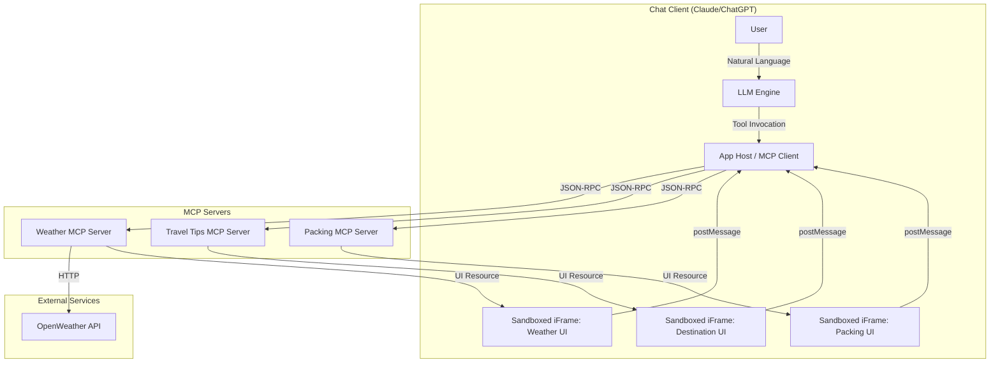
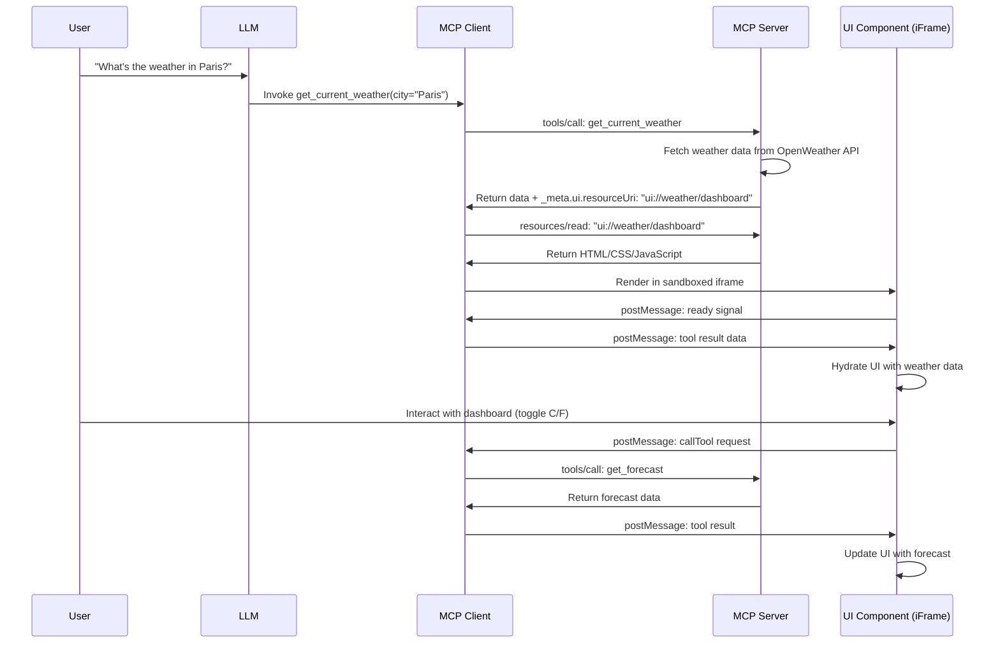

# Design Document: MCP Travel Planner UI

## Overview

The MCP Travel Planner UI is a learning-by-doing project that demonstrates how to build interactive visual interfaces for AI chat clients using the Model Context Protocol (MCP) and MCP Apps extension. The system consists of three specialized MCP servers (Weather, Travel Tips, and Packing) that expose tools, resources, prompts, and **interactive HTML/CSS/JavaScript UIs** that render in sandboxed iframes within conversational AI interfaces like Claude Desktop and ChatGPT.

### Key Innovation: MCP Apps

Traditional MCP integrations return plain text responses. This project leverages **MCP Apps**, the first official MCP extension, which enables tools to return rich, interactive UI components that render directly in chat windows. Users can interact with weather dashboards, check off packing items, and explore destination guides without leaving the conversation.

### Architecture Philosophy

The design follows a **modular, domain-separated architecture** where each MCP server is responsible for a specific domain (weather, travel tips, packing). Each server exposes:

1. **MCP Tools**: Callable functions that the LLM can invoke during conversations
2. **MCP Resources**: Data sources accessible via URI patterns (including UI resources)
3. **MCP Prompts**: Pre-configured prompt templates for common scenarios
4. **UI Resources**: Interactive HTML/CSS/JavaScript interfaces served via `ui://` scheme

All UI components run in **sandboxed iframes** and communicate with the host via a secure **JSON-RPC over postMessage** protocol, ensuring security while enabling rich interactivity.

### Technology Stack

- **Backend**: Python 3.11+ with MCP SDK (`mcp` package)
- **Frontend**: Vanilla JavaScript, React, or Vue for UI components
- **UI Libraries**: Chart.js (visualizations), Leaflet (maps), Tailwind CSS (styling)
- **Build Tools**: Vite for bundling UI components
- **External APIs**: OpenWeather API for weather data
- **Transport**: stdio (local) and HTTP (remote deployment)
- **Deployment**: FastAPI Cloud for the FastAPI orchestrator and remote HTTP MCP endpoints


## Architecture

### High-Level System Architecture



### MCP Protocol Flow

The system follows the standard MCP protocol flow with the addition of UI resources:

1. **Initialization**: Chat client connects to MCP servers via stdio or HTTP transport
2. **Capability Negotiation**: Servers advertise available tools, resources, and prompts
3. **Conversation**: User interacts with LLM through natural language
4. **Tool Invocation**: LLM decides to invoke an MCP tool based on user intent
5. **Tool Response**: Server returns data with `_meta.ui.resourceUri` field
6. **UI Resource Fetch**: Client fetches the UI resource via `resources/read` request
7. **UI Rendering**: Client renders HTML in sandboxed iframe
8. **Bidirectional Communication**: UI and host communicate via postMessage

### MCP Apps Architecture

MCP Apps introduces a new pattern for returning interactive UIs:



### Transport Modes

The system supports two transport modes:

#### 1. Local (stdio) Transport

- **Use Case**: Development and local use with Claude Desktop
- **Communication**: Standard input/output streams
- **Process Model**: MCP server runs as subprocess of chat client
- **Configuration**: Defined in `claude_desktop_config.json`

```json
{
  "mcpServers": {
    "weather": {
      "command": "python",
      "args": ["-m", "weather_server"],
      "env": {
        "OPENWEATHER_API_KEY": "your_api_key"
      }
    }
  }
}
```

#### 2. Remote (HTTP) Transport

- **Use Case**: Production deployment, sharing with others
- **Communication**: HTTP/HTTPS requests
- **Process Model**: MCP server runs as standalone web service
- **Configuration**: URL endpoint in client settings

```json
{
  "mcpServers": {
    "weather": {
      "url": "https://weather-mcp.fly.dev",
      "headers": {
        "Authorization": "Bearer token"
      }
    }
  }
}
```

### Security Architecture

Security is implemented through multiple layers:

1. **Iframe Sandboxing**: All UI components run in sandboxed iframes with restricted permissions
2. **Content Security Policy (CSP)**: Strict CSP headers prevent XSS attacks
3. **Origin Validation**: All postMessage events validate sender origin
4. **Pre-declared Templates**: Hosts can review UI templates before rendering
5. **Auditable Communication**: All UI-to-host messages use JSON-RPC (loggable)
6. **User Consent**: Hosts can require approval for UI-initiated tool calls
7. **Environment Isolation**: API keys stored in environment variables, never in code


## Components and Interfaces

### 1. Weather MCP Server

**Responsibility**: Provide current weather data, forecasts, and interactive weather visualizations.

#### Tools

##### `get_current_weather`

```python
{
  "name": "get_current_weather",
  "description": "Get current weather conditions for a city with interactive dashboard UI",
  "inputSchema": {
    "type": "object",
    "properties": {
      "city": {
        "type": "string",
        "description": "City name (e.g., 'Paris', 'New York')"
      }
    },
    "required": ["city"]
  },
  "_meta": {
    "ui": {
      "resourceUri": "ui://weather/dashboard"
    }
  }
}
```

**Response Structure**:
```json
{
  "content": [
    {
      "type": "text",
      "text": "Current weather in Paris: 18°C, Partly Cloudy"
    }
  ],
  "structuredContent": {
    "city": "Paris",
    "temperature_celsius": 18,
    "temperature_fahrenheit": 64,
    "conditions": "Partly Cloudy",
    "humidity": 65,
    "wind_speed": 12,
    "precipitation_probability": 20,
    "icon": "02d",
    "timestamp": "2026-01-27T14:30:00Z"
  }
}
```

##### `get_forecast`

```python
{
  "name": "get_forecast",
  "description": "Get weather forecast for a city with interactive chart UI",
  "inputSchema": {
    "type": "object",
    "properties": {
      "city": {"type": "string"},
      "days": {
        "type": "integer",
        "description": "Number of days (1-5)",
        "default": 5
      }
    },
    "required": ["city"]
  },
  "_meta": {
    "ui": {
      "resourceUri": "ui://weather/forecast-chart"
    }
  }
}
```

**Response Structure**:
```json
{
  "content": [
    {
      "type": "text",
      "text": "5-day forecast for Paris available in interactive chart"
    }
  ],
  "structuredContent": {
    "city": "Paris",
    "forecasts": [
      {
        "date": "2026-01-28",
        "temp_high_c": 20,
        "temp_low_c": 12,
        "temp_high_f": 68,
        "temp_low_f": 54,
        "conditions": "Sunny",
        "precipitation_prob": 10,
        "humidity": 60,
        "wind_speed": 8,
        "icon": "01d"
      }
      // ... 4 more days
    ]
  }
}
```

#### Resources

##### `city_forecast`

```python
{
  "uri": "weather://forecast/{city}",
  "name": "city_forecast",
  "description": "Weather forecast data for a specific city",
  "mimeType": "application/json"
}
```

##### `weather_dashboard_ui`

```python
{
  "uri": "ui://weather/dashboard",
  "name": "weather_dashboard_ui",
  "description": "Interactive weather dashboard UI",
  "mimeType": "text/html;profile=mcp-app"
}
```

##### `forecast_chart_ui`

```python
{
  "uri": "ui://weather/forecast-chart",
  "name": "forecast_chart_ui",
  "description": "Interactive 5-day forecast chart UI",
  "mimeType": "text/html;profile=mcp-app"
}
```

#### Prompts

##### `weather_comparison`

```python
{
  "name": "weather_comparison",
  "description": "Compare weather between origin and destination",
  "arguments": [
    {
      "name": "origin_city",
      "description": "Origin city name",
      "required": true
    },
    {
      "name": "destination_city",
      "description": "Destination city name",
      "required": true
    },
    {
      "name": "travel_date",
      "description": "Travel date (YYYY-MM-DD)",
      "required": true
    }
  ]
}
```

#### External Integration: OpenWeather API

**Endpoints Used**:
- Current Weather: `https://api.openweathermap.org/data/2.5/weather?q={city}&appid={key}&units=metric`
- 5-Day Forecast: `https://api.openweathermap.org/data/2.5/forecast?q={city}&appid={key}&units=metric`

**Caching Strategy**:
- Cache duration: 10 minutes
- Cache key: `weather:{city}:{endpoint}`
- Invalidation: Time-based (TTL)

**Error Handling**:
- Retry logic: 3 attempts with exponential backoff (1s, 2s, 4s)
- Rate limit handling: Return error with retry-after time
- Invalid city: Return descriptive error message

### 2. Travel Tips MCP Server

**Responsibility**: Provide destination information, activity recommendations, and local tips with interactive guides.

#### Tools

##### `get_destination_tips`

```python
{
  "name": "get_destination_tips",
  "description": "Get destination tips and information with interactive guide UI",
  "inputSchema": {
    "type": "object",
    "properties": {
      "city": {"type": "string"}
    },
    "required": ["city"]
  },
  "_meta": {
    "ui": {
      "resourceUri": "ui://travel/destination-guide"
    }
  }
}
```

**Response Structure**:
```json
{
  "content": [
    {
      "type": "text",
      "text": "Destination guide for Paris available"
    }
  ],
  "structuredContent": {
    "city": "Paris",
    "overview": "Paris, the City of Light, is renowned for...",
    "best_time": "April-June, September-October",
    "activities": [
      {
        "id": "eiffel-tower",
        "name": "Eiffel Tower",
        "category": "landmark",
        "description": "Iconic iron lattice tower...",
        "duration_hours": 2,
        "cost_usd": 25,
        "weather_dependent": false,
        "image_url": "https://..."
      }
    ],
    "tips": [
      {
        "category": "transportation",
        "icon": "metro",
        "text": "Buy a Paris Visite pass for unlimited metro travel"
      }
    ],
    "coordinates": {
      "lat": 48.8566,
      "lon": 2.3522
    }
  }
}
```

##### `recommend_activities`

```python
{
  "name": "recommend_activities",
  "description": "Recommend activities based on weather and season",
  "inputSchema": {
    "type": "object",
    "properties": {
      "city": {"type": "string"},
      "weather": {"type": "string"},
      "season": {"type": "string"}
    },
    "required": ["city"]
  },
  "_meta": {
    "ui": {
      "resourceUri": "ui://travel/activity-cards"
    }
  }
}
```

#### Resources

##### `destination_guide_ui`

```python
{
  "uri": "ui://travel/destination-guide",
  "name": "destination_guide_ui",
  "description": "Interactive destination guide with tabs and maps",
  "mimeType": "text/html;profile=mcp-app"
}
```

##### `activity_cards_ui`

```python
{
  "uri": "ui://travel/activity-cards",
  "name": "activity_cards_ui",
  "description": "Interactive activity recommendation cards",
  "mimeType": "text/html;profile=mcp-app"
}
```

#### Prompts

##### `destination_briefing`

```python
{
  "name": "destination_briefing",
  "description": "Generate comprehensive destination briefing",
  "arguments": [
    {
      "name": "city",
      "description": "Destination city",
      "required": true
    },
    {
      "name": "duration_days",
      "description": "Trip duration in days",
      "required": true
    }
  ]
}
```

### 3. Packing MCP Server

**Responsibility**: Generate intelligent packing lists based on weather and trip parameters with interactive checklist UI.

#### Tools

##### `generate_packing_list`

```python
{
  "name": "generate_packing_list",
  "description": "Generate weather-based packing list with interactive checklist UI",
  "inputSchema": {
    "type": "object",
    "properties": {
      "destination": {"type": "string"},
      "duration_days": {"type": "integer"},
      "weather_forecast": {
        "type": "object",
        "description": "Weather forecast data"
      }
    },
    "required": ["destination", "duration_days"]
  },
  "_meta": {
    "ui": {
      "resourceUri": "ui://packing/checklist"
    }
  }
}
```

**Response Structure**:
```json
{
  "content": [
    {
      "type": "text",
      "text": "Packing list for 5-day trip to Paris generated"
    }
  ],
  "structuredContent": {
    "destination": "Paris",
    "duration_days": 5,
    "weather_summary": "Mild temperatures (15-20°C), 30% chance of rain",
    "categories": {
      "clothing": {
        "icon": "shirt",
        "items": [
          {
            "id": "t-shirts",
            "name": "T-shirts",
            "quantity": 3,
            "weather_based": false,
            "checked": false
          },
          {
            "id": "light-jacket",
            "name": "Light jacket",
            "quantity": 1,
            "weather_based": true,
            "reason": "Temperatures 15-20°C",
            "checked": false
          }
        ]
      },
      "toiletries": {
        "icon": "toothbrush",
        "items": [
          {
            "id": "toothbrush",
            "name": "Toothbrush",
            "quantity": 1,
            "weather_based": false,
            "checked": false
          }
        ]
      },
      "electronics": {
        "icon": "phone",
        "items": [
          {
            "id": "phone-charger",
            "name": "Phone charger",
            "quantity": 1,
            "weather_based": false,
            "checked": false
          }
        ]
      },
      "documents": {
        "icon": "passport",
        "items": [
          {
            "id": "passport",
            "name": "Passport",
            "quantity": 1,
            "weather_based": false,
            "checked": false
          }
        ]
      },
      "accessories": {
        "icon": "umbrella",
        "items": [
          {
            "id": "umbrella",
            "name": "Umbrella",
            "quantity": 1,
            "weather_based": true,
            "reason": "30% chance of rain",
            "checked": false
          }
        ]
      }
    }
  }
}
```

#### Resources

##### `packing_checklist_ui`

```python
{
  "uri": "ui://packing/checklist",
  "name": "packing_checklist_ui",
  "description": "Interactive packing checklist with progress tracking",
  "mimeType": "text/html;profile=mcp-app"
}
```

#### Prompts

##### `packing_advisor`

```python
{
  "name": "packing_advisor",
  "description": "Provide packing advice based on trip parameters",
  "arguments": [
    {
      "name": "origin",
      "description": "Origin city",
      "required": true
    },
    {
      "name": "destination",
      "description": "Destination city",
      "required": true
    },
    {
      "name": "duration_days",
      "description": "Trip duration",
      "required": true
    },
    {
      "name": "activities",
      "description": "Planned activities",
      "required": false
    }
  ]
}
```

### 4. MCP Apps UI Components

Each UI component is a self-contained HTML/CSS/JavaScript bundle that:
- Runs in a sandboxed iframe
- Communicates via JSON-RPC over postMessage
- Implements the MCP Apps SDK interface
- Follows responsive design principles

#### Component Structure

```
ui-components/
├── weather-dashboard/
│   ├── index.html          # Entry point
│   ├── app.tsx             # React component
│   ├── styles.css          # Component styles
│   └── chart-config.ts     # Chart.js configuration
├── forecast-chart/
│   ├── index.html
│   ├── app.tsx
│   └── styles.css
├── destination-guide/
│   ├── index.html
│   ├── app.tsx
│   ├── map.ts              # Leaflet map integration
│   └── styles.css
├── activity-cards/
│   ├── index.html
│   ├── app.tsx
│   └── styles.css
├── packing-checklist/
│   ├── index.html
│   ├── app.tsx
│   └── styles.css
└── shared/
    ├── components/         # Reusable UI primitives
    ├── styles/            # Shared CSS
    └── utils/             # Shared utilities
```


## Data Models

### Weather Data Models

```python
from pydantic import BaseModel, Field
from datetime import datetime
from typing import Optional

class CurrentWeather(BaseModel):
    """Current weather conditions for a city"""
    city: str
    temperature_celsius: float
    temperature_fahrenheit: float
    conditions: str  # e.g., "Partly Cloudy", "Rainy"
    humidity: int  # percentage
    wind_speed: float  # km/h
    precipitation_probability: int  # percentage
    icon: str  # OpenWeather icon code
    timestamp: datetime

class DailyForecast(BaseModel):
    """Single day weather forecast"""
    date: str  # YYYY-MM-DD
    temp_high_c: float
    temp_low_c: float
    temp_high_f: float
    temp_low_f: float
    conditions: str
    precipitation_prob: int
    humidity: int
    wind_speed: float
    icon: str

class WeatherForecast(BaseModel):
    """Multi-day weather forecast"""
    city: str
    forecasts: list[DailyForecast] = Field(min_length=1, max_length=5)

class WeatherToolResponse(BaseModel):
    """Standard response format for weather tools"""
    content: list[dict]  # Text content for LLM
    structuredContent: CurrentWeather | WeatherForecast  # Data for UI
```

### Travel Tips Data Models

```python
class Activity(BaseModel):
    """Single activity or attraction"""
    id: str
    name: str
    category: str  # "landmark", "museum", "outdoor", "food", "nightlife"
    description: str
    duration_hours: float
    cost_usd: Optional[float]
    weather_dependent: bool
    image_url: Optional[str]

class Tip(BaseModel):
    """Local tip or advice"""
    category: str  # "transportation", "safety", "culture", "money"
    icon: str
    text: str

class Coordinates(BaseModel):
    """Geographic coordinates"""
    lat: float
    lon: float

class DestinationInfo(BaseModel):
    """Complete destination information"""
    city: str
    overview: str
    best_time: str
    activities: list[Activity]
    tips: list[Tip]
    coordinates: Coordinates

class ActivityRecommendations(BaseModel):
    """Weather-based activity recommendations"""
    city: str
    weather: str
    season: str
    recommended_activities: list[Activity]
    weather_note: str
```

### Packing List Data Models

```python
class PackingItem(BaseModel):
    """Single item in packing list"""
    id: str
    name: str
    quantity: int
    weather_based: bool
    reason: Optional[str]  # Explanation for weather-based items
    checked: bool = False

class PackingCategory(BaseModel):
    """Category of packing items"""
    icon: str
    items: list[PackingItem]

class PackingList(BaseModel):
    """Complete packing list"""
    destination: str
    duration_days: int
    weather_summary: str
    categories: dict[str, PackingCategory]  # Key: category name
    
    def total_items(self) -> int:
        """Calculate total number of items"""
        return sum(len(cat.items) for cat in self.categories.values())
    
    def checked_items(self) -> int:
        """Calculate number of checked items"""
        return sum(
            sum(1 for item in cat.items if item.checked)
            for cat in self.categories.values()
        )
    
    def progress_percentage(self) -> float:
        """Calculate packing progress percentage"""
        total = self.total_items()
        if total == 0:
            return 0.0
        return (self.checked_items() / total) * 100
```

### MCP Protocol Data Models

```python
class ToolMetadata(BaseModel):
    """Metadata for MCP tool including UI resource reference"""
    ui: Optional[dict] = None  # {"resourceUri": "ui://..."}

class ToolDefinition(BaseModel):
    """MCP tool definition"""
    name: str
    description: str
    inputSchema: dict  # JSON Schema
    _meta: Optional[ToolMetadata] = None

class ResourceDefinition(BaseModel):
    """MCP resource definition"""
    uri: str
    name: str
    description: str
    mimeType: str

class PromptArgument(BaseModel):
    """Argument for MCP prompt"""
    name: str
    description: str
    required: bool

class PromptDefinition(BaseModel):
    """MCP prompt definition"""
    name: str
    description: str
    arguments: list[PromptArgument]
```

### PostMessage Protocol Data Models

```python
class PostMessageRequest(BaseModel):
    """JSON-RPC request from UI to host"""
    jsonrpc: str = "2.0"
    id: str | int
    method: str  # "callTool", "sendMessage", "getContext"
    params: Optional[dict] = None

class PostMessageResponse(BaseModel):
    """JSON-RPC response from host to UI"""
    jsonrpc: str = "2.0"
    id: str | int
    result: Optional[dict] = None
    error: Optional[dict] = None

class PostMessageNotification(BaseModel):
    """JSON-RPC notification (no response expected)"""
    jsonrpc: str = "2.0"
    method: str  # "dataUpdate", "themeChange"
    params: Optional[dict] = None

class CallToolParams(BaseModel):
    """Parameters for callTool request"""
    toolName: str
    arguments: dict

class SendMessageParams(BaseModel):
    """Parameters for sendMessage request"""
    message: str
    role: str = "user"
```

### Configuration Data Models

```python
class ServerConfig(BaseModel):
    """Configuration for a single MCP server"""
    name: str
    command: Optional[str] = None  # For stdio transport
    args: Optional[list[str]] = None
    url: Optional[str] = None  # For HTTP transport
    env: Optional[dict[str, str]] = None
    headers: Optional[dict[str, str]] = None

class MCPClientConfig(BaseModel):
    """Complete MCP client configuration"""
    mcpServers: dict[str, ServerConfig]

class EnvironmentConfig(BaseModel):
    """Environment-specific configuration"""
    environment: str  # "development", "staging", "production"
    openweather_api_key: str
    log_level: str = "INFO"
    cache_ttl_seconds: int = 600
    max_retries: int = 3
    request_timeout_seconds: int = 30
```


## Correctness Properties

*A property is a characteristic or behavior that should hold true across all valid executions of a system—essentially, a formal statement about what the system should do. Properties serve as the bridge between human-readable specifications and machine-verifiable correctness guarantees.*

### Property Reflection

After analyzing all acceptance criteria, I identified the following testable properties. I've eliminated redundancy by:
- Combining similar tool response structure checks into a single comprehensive property
- Merging weather-based packing logic into temperature range properties
- Consolidating validation properties across different components
- Removing properties that are subsumed by more general properties

The following properties provide unique validation value without logical redundancy:

### Property 1: MCP Tool Response Structure Completeness

*For any* MCP tool that supports UI rendering (get_current_weather, get_forecast, get_destination_tips, recommend_activities, generate_packing_list), the tool response SHALL include both `content` (for LLM) and `structuredContent` (for UI) fields, and SHALL include a `_meta.ui.resourceUri` field pointing to a valid UI resource.

**Validates: Requirements 1.1, 1.2, 1.5, 1.6, 1.8, 1.11**

### Property 2: UI Resource Accessibility and Format

*For any* UI resource URI with the `ui://` scheme, the resource SHALL be accessible via the MCP resources/read protocol, SHALL return content with MIME type `text/html;profile=mcp-app`, and SHALL contain valid HTML that can be parsed without errors.

**Validates: Requirements 1.12, 16.1, 16.2, 16.3, 16.4, 16.5, 16.6, 16.9**

### Property 3: MCP Resource URI Pattern Resolution

*For any* city name, the resource URI pattern `weather://forecast/{city}` SHALL resolve to an accessible resource that returns weather forecast data in JSON format.

**Validates: Requirements 1.3**

### Property 4: PostMessage JSON-RPC Protocol Compliance

*For any* message sent from a UI component to the host via postMessage, the message SHALL conform to JSON-RPC 2.0 format with required fields (jsonrpc, id, method) and SHALL include valid method names (callTool, sendMessage, getContext).

**Validates: Requirements 20.1, 20.4, 20.5**

### Property 5: PostMessage Origin Validation

*For any* postMessage event received by a UI component, if the event origin does not match the expected host origin, the message SHALL be rejected and not processed.

**Validates: Requirements 20.7**

### Property 6: Request ID Uniqueness

*For any* sequence of JSON-RPC requests generated by a UI component, all request IDs SHALL be unique within that sequence.

**Validates: Requirements 20.10**

### Property 7: Weather Data Response Structure

*For any* valid city name, the get_current_weather tool SHALL return a response with structuredContent containing all required fields: city, temperature_celsius, temperature_fahrenheit, conditions, humidity, wind_speed, precipitation_probability, icon, and timestamp.

**Validates: Requirements 3.2**

### Property 8: Forecast Data Completeness

*For any* valid city name and day count (1-5), the get_forecast tool SHALL return a response with structuredContent containing a forecasts array with exactly the requested number of daily forecasts, each containing all required fields.

**Validates: Requirements 3.3**

### Property 9: Cold Weather Packing Items

*For any* weather forecast where the minimum temperature is below 10°C, the generated packing list SHALL include cold weather items (heavy coat, gloves, scarf, thermal underwear) in the clothing category.

**Validates: Requirements 4.1**

### Property 10: Mild Weather Packing Items

*For any* weather forecast where temperatures are between 10°C and 20°C, the generated packing list SHALL include mild weather items (light jacket, long pants, umbrella) in the clothing category.

**Validates: Requirements 4.2**

### Property 11: Warm Weather Packing Items

*For any* weather forecast where temperatures are between 20°C and 30°C, the generated packing list SHALL include warm weather items (t-shirts, shorts, sunscreen, sunglasses) in the clothing category.

**Validates: Requirements 4.3**

### Property 12: Hot Weather Packing Items

*For any* weather forecast where the maximum temperature exceeds 30°C, the generated packing list SHALL include hot weather items (light clothing, sandals, high SPF sunscreen, water bottle) in the clothing category.

**Validates: Requirements 4.4**

### Property 13: Laundry Items for Extended Trips

*For any* trip duration exceeding 3 days, the generated packing list SHALL include laundry-related items in the accessories category.

**Validates: Requirements 4.5**

### Property 14: Rain Gear for Precipitation

*For any* weather forecast where precipitation probability exceeds 30%, the generated packing list SHALL include rain gear (umbrella, rain jacket) marked as weather-based items with appropriate reason.

**Validates: Requirements 4.6**

### Property 15: Clothing Quantity Scaling

*For any* trip duration, the generated packing list SHALL include clothing quantities that follow the scaling rule: minimum 3 days of clothing, then additional items for each 2 days beyond that.

**Validates: Requirements 4.7**

### Property 16: Packing Progress Calculation

*For any* packing list state, the progress percentage SHALL equal (number of checked items / total number of items) × 100, and SHALL be between 0 and 100 inclusive.

**Validates: Requirements 18.3**

### Property 17: localStorage Persistence Round-Trip

*For any* packing checklist state (set of checked items), saving the state to localStorage and then reloading SHALL result in the same set of items being checked.

**Validates: Requirements 18.7**

### Property 18: Cache TTL Behavior

*For any* cached weather data, retrieving the data within the TTL period (10 minutes) SHALL return the cached data without making a new API call, and retrieving after the TTL period SHALL make a new API call and update the cache.

**Validates: Requirements 13.2, 13.7**

### Property 19: Input Validation Before API Calls

*For any* invalid input parameters (empty city name, invalid day count, negative duration), the tool SHALL reject the input with a validation error before making any external API calls.

**Validates: Requirements 9.10, 11.4, 11.5, 11.6**

### Property 20: Error Response Format Consistency

*For any* error condition (API failure, invalid input, timeout), the error response SHALL be valid JSON containing an error message field that describes the error in user-friendly language.

**Validates: Requirements 9.9**

### Property 21: Retry Logic with Exponential Backoff

*For any* failed external API call, the system SHALL retry up to 3 times with exponential backoff delays (1s, 2s, 4s), and SHALL only return an error after all retries are exhausted.

**Validates: Requirements 9.1**

### Property 22: Tool Response Schema Validation

*For any* tool response, the response SHALL validate successfully against the tool's defined response schema (Pydantic model), ensuring type correctness and required field presence.

**Validates: Requirements 11.7**

### Property 23: Configuration Validation

*For any* server configuration, if required environment variables (OPENWEATHER_API_KEY) are missing, the server SHALL fail to start and SHALL log which variables are missing.

**Validates: Requirements 6.8**


## Error Handling

### Error Categories

The system handles four main categories of errors:

1. **External API Errors**: OpenWeather API failures, timeouts, rate limits
2. **Validation Errors**: Invalid input parameters, malformed requests
3. **Protocol Errors**: MCP protocol violations, postMessage failures
4. **System Errors**: Configuration issues, resource not found, internal failures

### Error Handling Strategy

#### 1. External API Errors

**OpenWeather API Failures**:
```python
class WeatherAPIError(Exception):
    """Base exception for weather API errors"""
    pass

class WeatherAPIUnavailable(WeatherAPIError):
    """API is unreachable or returning 5xx errors"""
    pass

class WeatherAPIRateLimited(WeatherAPIError):
    """API rate limit exceeded"""
    def __init__(self, retry_after: int):
        self.retry_after = retry_after
        super().__init__(f"Rate limit exceeded. Retry after {retry_after} seconds")

class CityNotFound(WeatherAPIError):
    """City name not found in API"""
    pass
```

**Retry Logic**:
```python
async def fetch_with_retry(
    url: str,
    max_retries: int = 3,
    timeout: int = 30
) -> dict:
    """Fetch data with exponential backoff retry"""
    for attempt in range(max_retries):
        try:
            async with httpx.AsyncClient(timeout=timeout) as client:
                response = await client.get(url)
                response.raise_for_status()
                return response.json()
        except httpx.HTTPStatusError as e:
            if e.response.status_code == 404:
                raise CityNotFound("City not found")
            elif e.response.status_code == 429:
                retry_after = int(e.response.headers.get("Retry-After", 60))
                raise WeatherAPIRateLimited(retry_after)
            elif e.response.status_code >= 500:
                if attempt < max_retries - 1:
                    delay = 2 ** attempt  # Exponential backoff: 1s, 2s, 4s
                    await asyncio.sleep(delay)
                    continue
                raise WeatherAPIUnavailable("Weather service unavailable")
        except httpx.TimeoutException:
            if attempt < max_retries - 1:
                delay = 2 ** attempt
                await asyncio.sleep(delay)
                continue
            raise WeatherAPIUnavailable("Weather service timeout")
    
    raise WeatherAPIUnavailable("Max retries exceeded")
```

**Error Response Format**:
```python
def create_error_response(error: Exception, context: str) -> dict:
    """Create standardized error response"""
    return {
        "content": [
            {
                "type": "text",
                "text": f"Error: {str(error)}"
            }
        ],
        "isError": True,
        "error": {
            "type": type(error).__name__,
            "message": str(error),
            "context": context
        }
    }
```

#### 2. Validation Errors

**Input Validation**:
```python
from pydantic import BaseModel, validator, ValidationError

class GetWeatherInput(BaseModel):
    city: str
    
    @validator('city')
    def city_not_empty(cls, v):
        if not v or not v.strip():
            raise ValueError("City name cannot be empty")
        return v.strip()

class GetForecastInput(BaseModel):
    city: str
    days: int = 5
    
    @validator('city')
    def city_not_empty(cls, v):
        if not v or not v.strip():
            raise ValueError("City name cannot be empty")
        return v.strip()
    
    @validator('days')
    def days_in_range(cls, v):
        if v < 1 or v > 5:
            raise ValueError("Days must be between 1 and 5")
        return v

# Usage in tool handler
async def handle_get_weather(params: dict) -> dict:
    try:
        validated = GetWeatherInput(**params)
        # Proceed with validated input
    except ValidationError as e:
        return create_error_response(
            e,
            "Invalid input parameters"
        )
```

#### 3. Protocol Errors

**MCP Protocol Validation**:
```python
class MCPProtocolError(Exception):
    """MCP protocol violation"""
    pass

def validate_tool_response(response: dict) -> None:
    """Validate tool response follows MCP protocol"""
    if "content" not in response:
        raise MCPProtocolError("Tool response missing 'content' field")
    
    if not isinstance(response["content"], list):
        raise MCPProtocolError("'content' must be a list")
    
    for item in response["content"]:
        if "type" not in item:
            raise MCPProtocolError("Content item missing 'type' field")
```

**PostMessage Error Handling**:
```javascript
// In UI component
window.addEventListener('message', (event) => {
  // Validate origin
  const allowedOrigins = ['https://claude.ai', 'https://chatgpt.com'];
  if (!allowedOrigins.includes(event.origin)) {
    console.error('Rejected message from unauthorized origin:', event.origin);
    return;
  }
  
  // Validate JSON-RPC format
  try {
    const message = event.data;
    if (message.jsonrpc !== '2.0') {
      throw new Error('Invalid JSON-RPC version');
    }
    
    // Process message
    handleMessage(message);
  } catch (error) {
    console.error('Error processing message:', error);
    sendErrorResponse(event.source, {
      jsonrpc: '2.0',
      id: event.data.id,
      error: {
        code: -32600,
        message: 'Invalid Request',
        data: error.message
      }
    });
  }
});
```

#### 4. System Errors

**Configuration Errors**:
```python
class ConfigurationError(Exception):
    """Configuration is invalid or incomplete"""
    pass

def validate_configuration() -> None:
    """Validate required configuration on startup"""
    required_vars = ['OPENWEATHER_API_KEY']
    missing = [var for var in required_vars if not os.getenv(var)]
    
    if missing:
        raise ConfigurationError(
            f"Missing required environment variables: {', '.join(missing)}"
        )
```

**Resource Not Found**:
```python
class ResourceNotFound(Exception):
    """Requested resource does not exist"""
    pass

async def handle_resource_read(uri: str) -> dict:
    """Handle resource read request"""
    resource = resource_registry.get(uri)
    if not resource:
        raise ResourceNotFound(f"Resource not found: {uri}")
    
    return {
        "contents": [
            {
                "uri": uri,
                "mimeType": resource.mime_type,
                "text": resource.content
            }
        ]
    }
```

### Error Logging

All errors are logged with appropriate context:

```python
import logging
import json

logger = logging.getLogger(__name__)

def log_error(error: Exception, context: dict) -> None:
    """Log error with context"""
    logger.error(
        "Error occurred",
        extra={
            "error_type": type(error).__name__,
            "error_message": str(error),
            "context": context,
            "timestamp": datetime.utcnow().isoformat()
        },
        exc_info=True
    )

# Usage
try:
    result = await fetch_weather(city)
except WeatherAPIError as e:
    log_error(e, {
        "operation": "fetch_weather",
        "city": city,
        "tool": "get_current_weather"
    })
    return create_error_response(e, "Failed to fetch weather data")
```

### User-Facing Error Messages

Error messages are designed to be helpful and actionable:

| Error Type | User Message | Action |
|------------|--------------|--------|
| City Not Found | "I couldn't find weather data for '{city}'. Please check the city name and try again." | Suggest correct spelling |
| API Unavailable | "The weather service is temporarily unavailable. Please try again in a few minutes." | Retry later |
| Rate Limited | "Too many requests. Please wait {seconds} seconds before trying again." | Wait and retry |
| Invalid Input | "Please provide a valid city name." | Correct input |
| Timeout | "The request took too long. Please try again." | Retry |
| Configuration Error | "The weather service is not properly configured. Please contact support." | Admin action needed |


## Testing Strategy

### Overview

The testing strategy employs a **dual approach** combining property-based testing and example-based unit testing to ensure comprehensive coverage:

- **Property-based tests**: Verify universal properties across all valid inputs (100+ iterations per property)
- **Unit tests**: Verify specific examples, edge cases, and integration points
- **Integration tests**: Verify MCP protocol communication and external API integration
- **UI component tests**: Verify HTML structure, JavaScript functionality, and postMessage communication

### Property-Based Testing

Property-based testing is appropriate for this feature because:
- The system has clear input/output behavior (tools accept parameters, return structured data)
- There are universal properties that should hold across wide input ranges (response structure, validation, packing logic)
- The input space is large (any city name, any temperature range, any trip duration)
- We're testing parsers (JSON-RPC), data transformations (weather to packing items), and business logic

**Library Choice**: `hypothesis` for Python (property-based testing library)

**Configuration**:
```python
from hypothesis import given, settings, strategies as st

# Configure for minimum 100 iterations per property
@settings(max_examples=100)
@given(city=st.text(min_size=1, max_size=50))
def test_property_weather_response_structure(city):
    """Property 1: Tool response structure completeness"""
    # Test implementation
    pass
```

#### Property Test Implementation Examples

**Property 1: MCP Tool Response Structure**
```python
from hypothesis import given, settings
from hypothesis import strategies as st
import pytest

@settings(max_examples=100)
@given(city=st.text(min_size=1, max_size=50, alphabet=st.characters(whitelist_categories=('L',))))
def test_weather_tool_response_structure(city):
    """
    Feature: mcp-travel-planner-ui, Property 1: MCP Tool Response Structure Completeness
    
    For any MCP tool that supports UI rendering, the tool response SHALL include
    both content and structuredContent fields, and SHALL include a _meta.ui.resourceUri field.
    """
    # Arrange
    weather_server = WeatherMCPServer()
    
    # Act
    response = weather_server.get_current_weather(city=city)
    
    # Assert
    assert "content" in response, "Response missing 'content' field"
    assert "structuredContent" in response, "Response missing 'structuredContent' field"
    assert isinstance(response["content"], list), "'content' must be a list"
    assert len(response["content"]) > 0, "'content' must not be empty"
    
    # Check _meta.ui.resourceUri in tool definition
    tool_def = weather_server.get_tool_definition("get_current_weather")
    assert "_meta" in tool_def, "Tool definition missing '_meta' field"
    assert "ui" in tool_def["_meta"], "Tool _meta missing 'ui' field"
    assert "resourceUri" in tool_def["_meta"]["ui"], "Tool _meta.ui missing 'resourceUri'"
    assert tool_def["_meta"]["ui"]["resourceUri"].startswith("ui://"), "resourceUri must use ui:// scheme"
```

**Property 9-12: Weather-Based Packing Logic**
```python
@settings(max_examples=100)
@given(
    min_temp=st.floats(min_value=-20, max_value=5),
    max_temp=st.floats(min_value=0, max_value=10),
    duration=st.integers(min_value=1, max_value=30)
)
def test_cold_weather_packing_items(min_temp, max_temp, duration):
    """
    Feature: mcp-travel-planner-ui, Property 9: Cold Weather Packing Items
    
    For any weather forecast where the minimum temperature is below 10°C,
    the generated packing list SHALL include cold weather items.
    """
    # Arrange
    packing_server = PackingMCPServer()
    forecast = create_forecast(min_temp=min_temp, max_temp=max_temp)
    
    # Act
    response = packing_server.generate_packing_list(
        destination="TestCity",
        duration_days=duration,
        weather_forecast=forecast
    )
    
    # Assert
    packing_list = response["structuredContent"]
    clothing_items = packing_list["categories"]["clothing"]["items"]
    item_names = [item["name"].lower() for item in clothing_items]
    
    # Check for cold weather items
    cold_weather_items = ["heavy coat", "gloves", "scarf", "thermal underwear"]
    for item in cold_weather_items:
        assert any(item in name for name in item_names), \
            f"Missing cold weather item '{item}' for temp {min_temp}°C - {max_temp}°C"

@settings(max_examples=100)
@given(
    precipitation_prob=st.integers(min_value=31, max_value=100),
    duration=st.integers(min_value=1, max_value=30)
)
def test_rain_gear_for_precipitation(precipitation_prob, duration):
    """
    Feature: mcp-travel-planner-ui, Property 14: Rain Gear for Precipitation
    
    For any weather forecast where precipitation probability exceeds 30%,
    the generated packing list SHALL include rain gear marked as weather-based items.
    """
    # Arrange
    packing_server = PackingMCPServer()
    forecast = create_forecast(precipitation_prob=precipitation_prob)
    
    # Act
    response = packing_server.generate_packing_list(
        destination="TestCity",
        duration_days=duration,
        weather_forecast=forecast
    )
    
    # Assert
    packing_list = response["structuredContent"]
    all_items = []
    for category in packing_list["categories"].values():
        all_items.extend(category["items"])
    
    # Find rain gear items
    rain_gear = [item for item in all_items 
                 if any(keyword in item["name"].lower() 
                       for keyword in ["umbrella", "rain jacket", "raincoat"])]
    
    assert len(rain_gear) > 0, f"Missing rain gear for {precipitation_prob}% precipitation"
    
    # Verify they're marked as weather-based
    for item in rain_gear:
        assert item["weather_based"] == True, f"Rain gear '{item['name']}' not marked as weather-based"
        assert item["reason"] is not None, f"Rain gear '{item['name']}' missing reason"
```

**Property 17: localStorage Persistence Round-Trip**
```python
@settings(max_examples=100)
@given(
    checked_items=st.lists(
        st.text(min_size=1, max_size=20),
        min_size=0,
        max_size=50,
        unique=True
    )
)
def test_localstorage_persistence_roundtrip(checked_items):
    """
    Feature: mcp-travel-planner-ui, Property 17: localStorage Persistence Round-Trip
    
    For any packing checklist state, saving to localStorage and reloading
    SHALL result in the same set of items being checked.
    """
    # Arrange
    checklist = PackingChecklist()
    for item_id in checked_items:
        checklist.check_item(item_id)
    
    # Act - Save to localStorage
    state = checklist.get_state()
    checklist.save_to_storage(state)
    
    # Create new checklist and load from storage
    new_checklist = PackingChecklist()
    loaded_state = new_checklist.load_from_storage()
    new_checklist.set_state(loaded_state)
    
    # Assert
    assert set(new_checklist.get_checked_items()) == set(checked_items), \
        "Checked items not preserved after localStorage round-trip"
```

**Property 21: Retry Logic with Exponential Backoff**
```python
@settings(max_examples=100)
@given(
    failure_count=st.integers(min_value=1, max_value=3)
)
def test_retry_logic_exponential_backoff(failure_count):
    """
    Feature: mcp-travel-planner-ui, Property 21: Retry Logic with Exponential Backoff
    
    For any failed external API call, the system SHALL retry up to 3 times
    with exponential backoff delays (1s, 2s, 4s).
    """
    # Arrange
    mock_api = MockWeatherAPI()
    mock_api.set_failure_count(failure_count)
    weather_client = WeatherAPIClient(api=mock_api)
    
    # Act
    start_time = time.time()
    try:
        result = weather_client.fetch_weather("TestCity")
    except WeatherAPIUnavailable:
        pass
    elapsed = time.time() - start_time
    
    # Assert
    assert mock_api.call_count == failure_count, \
        f"Expected {failure_count} retries, got {mock_api.call_count}"
    
    # Verify exponential backoff timing
    # Expected delays: 1s, 2s, 4s
    expected_delays = [2**i for i in range(failure_count - 1)]
    expected_total = sum(expected_delays)
    
    # Allow 0.5s tolerance for execution time
    assert elapsed >= expected_total - 0.5, \
        f"Retry delays too short: {elapsed}s < {expected_total}s"
    assert elapsed <= expected_total + 2.0, \
        f"Retry delays too long: {elapsed}s > {expected_total + 2}s"
```

### Unit Testing

Unit tests focus on specific examples, edge cases, and integration points that complement property-based tests.

#### Example Unit Tests

**Tool Registration**
```python
def test_weather_server_registers_all_tools():
    """Verify all required tools are registered"""
    server = WeatherMCPServer()
    tools = server.list_tools()
    tool_names = [t["name"] for t in tools]
    
    assert "get_current_weather" in tool_names
    assert "get_forecast" in tool_names

def test_tool_has_correct_schema():
    """Verify tool input schema is correct"""
    server = WeatherMCPServer()
    tool = server.get_tool_definition("get_current_weather")
    
    assert tool["inputSchema"]["type"] == "object"
    assert "city" in tool["inputSchema"]["properties"]
    assert "city" in tool["inputSchema"]["required"]
```

**Edge Cases**
```python
def test_empty_city_name_rejected():
    """Empty city name should be rejected"""
    server = WeatherMCPServer()
    response = server.get_current_weather(city="")
    
    assert response["isError"] == True
    assert "empty" in response["error"]["message"].lower()

def test_forecast_days_boundary():
    """Test boundary values for forecast days"""
    server = WeatherMCPServer()
    
    # Valid boundaries
    response = server.get_forecast(city="Paris", days=1)
    assert not response.get("isError")
    
    response = server.get_forecast(city="Paris", days=5)
    assert not response.get("isError")
    
    # Invalid boundaries
    response = server.get_forecast(city="Paris", days=0)
    assert response["isError"] == True
    
    response = server.get_forecast(city="Paris", days=6)
    assert response["isError"] == True

def test_zero_duration_packing_list():
    """Zero duration should be rejected"""
    server = PackingMCPServer()
    response = server.generate_packing_list(
        destination="Paris",
        duration_days=0,
        weather_forecast={}
    )
    
    assert response["isError"] == True
```

**Specific Scenarios**
```python
def test_paris_weather_response():
    """Test specific city: Paris"""
    server = WeatherMCPServer()
    response = server.get_current_weather(city="Paris")
    
    assert response["structuredContent"]["city"] == "Paris"
    assert "temperature_celsius" in response["structuredContent"]

def test_packing_list_for_beach_vacation():
    """Test packing list for hot beach destination"""
    server = PackingMCPServer()
    forecast = create_forecast(min_temp=28, max_temp=35, precipitation_prob=5)
    
    response = server.generate_packing_list(
        destination="Miami",
        duration_days=7,
        weather_forecast=forecast
    )
    
    items = get_all_items(response["structuredContent"])
    item_names = [item["name"].lower() for item in items]
    
    # Should include beach items
    assert any("sunscreen" in name for name in item_names)
    assert any("sunglasses" in name for name in item_names)
    assert any("swimsuit" in name or "swim" in name for name in item_names)
```

### Integration Testing

Integration tests verify MCP protocol communication and external API integration.

```python
@pytest.mark.integration
def test_mcp_server_stdio_communication():
    """Test MCP server communication via stdio"""
    # Start server as subprocess
    process = subprocess.Popen(
        ["python", "-m", "weather_server"],
        stdin=subprocess.PIPE,
        stdout=subprocess.PIPE,
        stderr=subprocess.PIPE,
        env={"OPENWEATHER_API_KEY": "test_key"}
    )
    
    # Send initialize request
    request = {
        "jsonrpc": "2.0",
        "id": 1,
        "method": "initialize",
        "params": {
            "protocolVersion": "2024-11-05",
            "capabilities": {}
        }
    }
    
    process.stdin.write(json.dumps(request).encode() + b'\n')
    process.stdin.flush()
    
    # Read response
    response_line = process.stdout.readline()
    response = json.loads(response_line)
    
    assert response["jsonrpc"] == "2.0"
    assert response["id"] == 1
    assert "result" in response
    assert "capabilities" in response["result"]
    
    process.terminate()

@pytest.mark.integration
def test_openweather_api_integration():
    """Test actual OpenWeather API integration"""
    api_key = os.getenv("OPENWEATHER_API_KEY")
    if not api_key:
        pytest.skip("OPENWEATHER_API_KEY not set")
    
    client = WeatherAPIClient(api_key=api_key)
    result = client.fetch_current_weather("London")
    
    assert result["name"] == "London"
    assert "main" in result
    assert "temp" in result["main"]
```

### UI Component Testing

UI component tests verify HTML structure, JavaScript functionality, and postMessage communication.

```python
@pytest.mark.ui
def test_weather_dashboard_html_structure():
    """Test weather dashboard HTML is well-formed"""
    server = WeatherMCPServer()
    resource = server.read_resource("ui://weather/dashboard")
    html_content = resource["contents"][0]["text"]
    
    # Parse HTML
    soup = BeautifulSoup(html_content, 'html.parser')
    
    # Verify structure
    assert soup.find('div', id='weather-dashboard') is not None
    assert soup.find('div', class_='temperature') is not None
    assert soup.find('div', class_='forecast-chart') is not None

@pytest.mark.ui
def test_postmessage_handler_registration():
    """Test that postMessage handlers are registered"""
    server = WeatherMCPServer()
    resource = server.read_resource("ui://weather/dashboard")
    html_content = resource["contents"][0]["text"]
    
    # Check for postMessage listener
    assert "addEventListener('message'" in html_content
    assert "window.parent.postMessage" in html_content

@pytest.mark.ui
def test_checklist_progress_calculation():
    """Test packing checklist progress calculation"""
    # Load checklist UI in headless browser
    driver = webdriver.Chrome(options=chrome_options)
    driver.get(checklist_url)
    
    # Check some items
    checkboxes = driver.find_elements(By.CSS_SELECTOR, 'input[type="checkbox"]')
    total = len(checkboxes)
    checkboxes[0].click()
    checkboxes[1].click()
    
    # Verify progress bar
    progress = driver.find_element(By.CLASS_NAME, 'progress-bar')
    progress_text = progress.text
    
    expected_percentage = (2 / total) * 100
    assert f"{expected_percentage:.0f}%" in progress_text
```

### Test Coverage Goals

- **Overall code coverage**: Minimum 80%
- **Property-based tests**: 23 properties, 100+ iterations each
- **Unit tests**: 50+ tests covering examples and edge cases
- **Integration tests**: 10+ tests for MCP protocol and API integration
- **UI component tests**: 15+ tests for HTML structure and JavaScript functionality

### Continuous Integration

All tests run automatically on:
- Every commit (unit tests, property tests)
- Pull requests (full test suite including integration tests)
- Nightly builds (extended property test runs with 1000+ iterations)

```yaml
# .github/workflows/test.yml
name: Test Suite
on: [push, pull_request]

jobs:
  test:
    runs-on: ubuntu-latest
    steps:
      - uses: actions/checkout@v2
      - name: Set up Python
        uses: actions/setup-python@v2
        with:
          python-version: '3.11'
      - name: Install dependencies
        run: |
          pip install -e ".[dev]"
      - name: Run unit tests
        run: pytest tests/unit -v
      - name: Run property tests
        run: pytest tests/properties -v --hypothesis-profile=ci
      - name: Run integration tests
        run: pytest tests/integration -v
        env:
          OPENWEATHER_API_KEY: ${{ secrets.OPENWEATHER_API_KEY }}
      - name: Check coverage
        run: pytest --cov=src --cov-report=xml --cov-report=term
      - name: Upload coverage
        uses: codecov/codecov-action@v2
```
