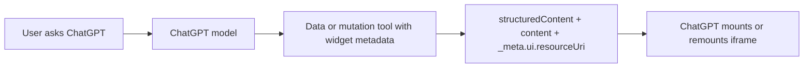
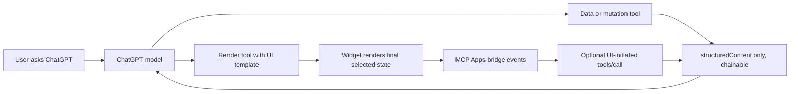

# refactor: Align Apps SDK trip workspace patterns

## Overview

Align the Travel MCP app with the current OpenAI Apps SDK guidance and official examples without restarting the product or rewriting the stack. The current MCP foundation is good: Python/FastMCP tools exist, the unified `/mcp/travel-agent/` endpoint is the right ChatGPT Developer Mode path, widgets are self-contained HTML resources, Storybook simulates the Apps bridge, and local tests cover trip state plus widget resources.

The next implementation should correct both product fit and architecture around richer trip workspace flows. For the current MVP, weather and forecast tools/widgets are out of scope because ChatGPT already handles that reasoning well enough. Destination-guide style long-form/static widgets are also out of MVP unless reframed as concise decision-support UI. Move only the widgets that pass the Apps SDK UX principles gate toward the decoupled pattern: data and mutation tools return reusable `structuredContent`; render tools own `_meta.ui.resourceUri` and `_meta["openai/outputTemplate"]`. This carries forward R1-R13 from the origin document (see origin: `docs/brainstorms/2026-05-05-apps-sdk-revalidation-requirements.md`).

## Problem Statement

The app currently risks failing two different Apps SDK UX tests. First, some widgets look closer to long-form/static content surfaces than focused ChatGPT actions; `travel_destination_guide` is the clearest candidate, and Trip Inbox can drift into a passive long list if it is not treated as a capture/triage surface. Second, `mcp_servers/travel_agent_server.py` attaches widget templates to many data/mutation tools. For example, `add_trip_item`, `list_trip_inbox`, `get_trip_board`, `get_trip_itinerary`, and `get_trip_budget` all return tool results with widget metadata. This works locally, but current Apps SDK docs warn that attaching a widget template to every tool call can cause unnecessary iframe re-renders and can prevent ChatGPT from reasoning over fetched or mutated data before deciding what UI to render.

The user-facing risk is now more basic than rendering behavior: if the app does not provide something better than base ChatGPT, the right answer is to remove or redesign that surface. The useful MVP center is persistent saved trip state plus guided in-chat decisions: "save this," "what still needs deciding?", "move this to booked," "show the current board," and "turn shortlisted items into an itinerary draft." The developer-facing risk is continued custom glue: every new widget would hand-roll descriptors, bridge behavior, state handling, and validation instead of adapting known OpenAI example patterns.

## Proposed Solution

Implement an Apps SDK alignment pass in phases:

1. Run an Apps SDK UX-principles triage against every current tool and widget.
2. Remove, defer, or redesign surfaces that fail the "helpful UI only" and "beyond base ChatGPT" tests.
3. Create an explicit MVP tool/resource descriptor map for the unified travel-agent app, marking weather, forecast, and static destination-guide surfaces out of scope.
4. Add descriptor metadata quality improvements: titles, intent descriptions, annotations, invocation status strings, and `_meta.ui.visibility` where needed.
5. Introduce data-only and render-only tools for non-trivial trip workspace widgets that survive UX triage.
6. Keep compatibility aliases for ChatGPT while treating `_meta.ui.*` as the primary metadata surface.
7. Adapt official OpenAI example patterns selectively: Pizzaz for list/map/carousel-style travel option surfaces, Kitchen Sink Lite for host APIs and UI-initiated tool calls, Shopping Cart for widget session/state patterns, and authenticated Python only when auth becomes necessary (see origin).
8. Expand Storybook and test coverage so the new flow is validated before hosted ChatGPT Developer Mode testing.

This should not introduce React/Tailwind/shadcn by default. The current vanilla self-contained widget path remains the implementation default until a specific widget needs a compiled component stack (see origin R9).

## Technical Approach

### Architecture

Current flow:



Target flow for richer trip workspace surfaces:



Keep the unified endpoint in `mcp_servers/travel_agent_server.py` as the primary app surface for trip workspace state (origin R3). Do not split the ChatGPT user experience back into several ChatGPT app surfaces. Do not spend current MVP effort aligning weather or forecast widgets.

### Implementation Phases

#### Phase 1: Apps SDK UX Principles Triage

Evaluate every current tool and widget against the Apps SDK UX principles before doing metadata or architecture work.

For each surface, answer:

- Conversational value: does this rely on natural language, thread context, multi-turn dialog, or saved trip context?
- Beyond base ChatGPT: does this provide new saved state, new action, proprietary/app data, specialized presentation, or a guided flow?
- Atomic model-friendly action: is the tool indivisible, self-contained, and explicit enough for ChatGPT to call confidently?
- Helpful UI only: would replacing this widget with plain text materially degrade the task?
- End-to-end in-chat completion: can the user finish a meaningful task without another tab?
- Performance: does this keep chat rhythm?
- Discoverability: is there an obvious prompt where ChatGPT should select the app?
- Platform fit: does it use prior context, multi-tool composition, memory, multimodality, or rich prompts?

Initial expected triage:

- Keep/refine: Trip Inbox only as compact capture/triage, Trip Board as structured decision state, Trip Itinerary as scheduled-state presentation, Trip Budget if saved prices/targets are part of the trip state.
- Defer/remove from MVP: weather and forecast.
- Remove or redesign: travel destination guide if it remains static long-form content. It may return concise text from ChatGPT instead, or become a guided decision-support tool only if it uses saved trip context.
- Review carefully: activity cards and packing checklist. Keep only if they use saved trip context or enable a clear in-chat task beyond base ChatGPT.

Success criteria:

- Every current widget has an MVP decision: keep, redesign, plain-text only, or out of scope.
- No widget remains in MVP just because it already exists.
- Trip Inbox has an explicit design constraint: compact triage and next actions, not long static content.

#### Phase 2: Descriptor Inventory And Capability Check

- Audit MVP-relevant `@server.tool` registrations in `mcp_servers/travel_agent_server.py`, plus supporting non-weather servers only if they remain in the MVP flow.
- Mark `mcp_servers/weather_server.py`, `get_current_weather`, `get_forecast`, weather/forecast widget resources, and static destination-guide resources as out of scope unless UX triage explicitly redesigns them into MVP surfaces.
- Produce a local descriptor map in code or docs that classifies each tool as:
  - data-only
  - mutation-only
  - render-only
  - simple one-shot data + render
- Verify whether FastMCP decorators expose the descriptor fields needed for `title`, annotations, `_meta.ui.visibility`, and status strings.
- If FastMCP decorators cannot express required fields cleanly, plan a focused lower-level registration patch for the affected tools only, using official Python examples as the model.
- Add or update tests that inspect tool descriptors if the current test harness can list them.

Success criteria:

- Every MVP-relevant tool has a documented classification, and weather/forecast surfaces are explicitly marked out of scope.
- The implementation path for descriptor metadata is known before tool splitting begins.
- No behavior changes yet unless descriptor-only metadata can be safely added.

#### Phase 3: Tool Metadata Quality Pass

- Add human-readable titles where the MCP Python surface supports them.
- Rewrite descriptions to start from user intent, not implementation detail. Example: prefer "Use this when the user wants to save a found hotel, flight, restaurant, activity, note, or booking fragment to a trip workspace" over "Save a raw travel fragment..."
- Add annotations:
  - read-only tools: `get_trip_summary`, `list_trip_inbox`, `get_trip_board`, `get_trip_itinerary`, `get_trip_budget`.
  - mutating tools: `create_trip`, `add_trip_item`, `update_trip_item_status`.
  - idempotent where true, especially duplicate-safe `add_trip_item`.
  - destructive false for status moves unless a future status permanently deletes or overwrites user data.
- Add `openai/toolInvocation/invoking` and `openai/toolInvocation/invoked` strings for ChatGPT UX.
- Keep `_meta.ui.resourceUri` as the standard UI pointer and `_meta["openai/outputTemplate"]` as the ChatGPT compatibility alias (origin R7).

Success criteria:

- Tool descriptors make ChatGPT tool selection easier.
- Metadata follows the current Apps SDK reference.
- Existing tests still pass.

#### Phase 4: Decouple Trip Workspace Data And Render Tools

Start with Trip Board because it aggregates the most state and is the clearest fit for decoupling.

Proposed first split:

- Keep `get_trip_board` as a data-only read tool returning board `structuredContent` with no UI template.
- Add `render_trip_board` as a render tool that takes the board payload or `trip_id`, returns equivalent `structuredContent`, and owns `ui://trip/board-...html` metadata.
- Consider whether `list_trip_inbox` should remain a simple renderable one-shot for now, while `add_trip_item` becomes data-only so saving a fragment does not always remount the inbox.
- Apply the same pattern later to `get_trip_itinerary` / `render_trip_itinerary` and `get_trip_budget` / `render_trip_budget`.

Do not split, polish, or validate weather/forecast widgets in this MVP pass. Preserve or align destination/activity/packing surfaces only if Phase 1 proves they directly support the trip workspace MVP and pass "beyond base ChatGPT" plus "helpful UI only."

Success criteria:

- ChatGPT can fetch/mutate trip state first, then render only the final selected view.
- Existing trip data shapes remain stable enough for widgets and tests.
- Render tool descriptions explicitly state their dependency, such as "Use after `get_trip_board` or when the user asks to show the visual trip board."

#### Phase 5: Widget Bridge And Official Example Pattern Adoption

- Keep support for `ui/notifications/tool-result` and `openai:set_globals` in each widget.
- Harden message handling by checking `event.source === window.parent` where practical, matching current OpenAI examples.
- Add a small reusable bridge helper pattern for static widgets if duplication becomes risky, while preserving self-contained HTML output.
- Extend Storybook's host harness in `mcp_servers/widgets/stories/renderWidget.ts` only if the aligned widgets need:
  - UI-initiated `tools/call`
  - `ui/message`
  - `ui/update-model-context`
  - display mode changes
  - widget state persistence
- Use Kitchen Sink Lite as the reference for host API behavior and Shopping Cart as the reference only when stable widget/session state is required (see origin R2).
- Do not add map/fullscreen/carousel components until a trip flow specifically needs them. If needed, adapt Pizzaz patterns rather than inventing a new component family.

Success criteria:

- Widgets remain portable MCP Apps components first, with ChatGPT-specific helpers feature-detected.
- Storybook can simulate the bridge paths the widgets rely on.
- No widget depends on external static assets or dev-server paths.

#### Phase 6: Versioning, Compatibility, And Resource Metadata

- Resolve the current deliberate drift where v3 HTML files are served behind older `ui://...-v1/v2.html` URIs.
- For each widget, decide and document:
  - compatible markup update behind current URI, with tests asserting intent
  - or material contract change requiring a new `ui://...-vN.html` URI
- Keep `text/html;profile=mcp-app`.
- Keep `_meta.ui.csp` with explicit `connectDomains` and `resourceDomains`.
- Add `_meta.ui.domain` only when the real hosted app domain is known.
- If `window.openai.openExternal` is introduced, include the required ChatGPT compatibility CSP redirect allowlist.

Success criteria:

- URI versioning no longer relies on implicit tribal knowledge.
- Resource metadata is correct for local validation and ready for production domain insertion later.

#### Phase 7: Validation And Hosted Developer Mode

- Run Python tests:

```bash
python -m pytest
```

- Run widget checks:

```bash
cd mcp_servers/widgets
npm run check
```

- Add or update focused tests for:
  - descriptor metadata
  - data-only tools not advertising render templates
  - render tools advertising both `_meta.ui.resourceUri` and `_meta["openai/outputTemplate"]`
  - resource URI versioning decisions
  - bridge event support in all production widgets
- Browser smoke Storybook at minimum:
  - Trip Board default and empty state
  - Trip Inbox long content
  - Trip Itinerary day grouping
  - Trip Budget no-budget and over-budget cases
  - Chat Preview trip-planning workspace
- Validate in ChatGPT Developer Mode over HTTPS using the unified endpoint:

```text
Create a Tokyo trip.
Save this hotel option to the Tokyo trip: Booking.com hotel near Shibuya, about $180/night.
Show my trip inbox.
Move the hotel to shortlisted.
Show my trip board.
```

Success criteria:

- Local tests and Storybook pass.
- ChatGPT can call the unified endpoint, use data tools, render the correct widget only when useful, and continue conversation from the resulting state.

## Alternative Approaches Considered

### Keep The Current Tool-Per-Widget Shape

Rejected for non-trivial trip workspace flows. It works for simple demos and some one-shot widgets, but the current Apps SDK docs recommend decoupling data processing from UI rendering when richer model reasoning or UI-initiated interactions are involved (see origin R4).

### Rewrite The App From An Official Example

Rejected. The repo already has working Python/FastMCP servers, trip persistence, tests, and product-specific widgets. Official examples should guide patterns, not replace the working app shape wholesale (see origin key decision: stay Python-first).

### Adopt React, Tailwind, Apps SDK UI, Or shadcn/ui Now

Rejected for this plan. The current problem is tool/render architecture and bridge alignment, not component library absence. If React becomes necessary later, Apps SDK UI should be evaluated before shadcn/ui (see origin R9).

### Split Supporting Features Into Separate ChatGPT Apps

Rejected. The unified `/mcp/travel-agent/` endpoint is the better user experience for trip workspace state (see origin R3). Weather and forecast are now excluded from the current MVP surface rather than split into separate app work.

## System-Wide Impact

### Interaction Graph

User request triggers ChatGPT tool choice. For trip workspace actions, ChatGPT should call a data or mutation tool first. That tool uses `get_trip_store()` in `mcp_servers/travel_agent_server.py`, which delegates persistence to `FileTripStore` or `PostgresTripStore` in `services/trips.py`. The tool returns model-visible `structuredContent`. ChatGPT may then call a render tool, which returns the widget template metadata and a final render payload. ChatGPT loads the matching `server.resource`, which returns static HTML from `mcp_servers/widgets/*.html`. The widget renders initial tool output and listens for bridge updates. UI actions may later call tools directly or send follow-up messages, depending on the chosen pattern.

### Error & Failure Propagation

Trip store errors currently flow through `_run_trip_tool()` and `_tool_error()` in `mcp_servers/travel_agent_server.py`, returning `isError=True`, `structuredContent={"error": ...}`, and model-readable `content`. The decoupled pattern must preserve equivalent error behavior for both data tools and render tools. Render tools should not hide upstream data errors behind empty widgets.

Potential failure points:

- Missing `DATABASE_URL` or unreachable Postgres.
- Invalid trip IDs or item IDs.
- Data tool succeeds but render tool receives stale or malformed payload.
- Widget receives a bridge payload wrapped differently than expected.
- Tool descriptor metadata fails to expose render tools correctly in ChatGPT.

### State Lifecycle Risks

`create_trip`, `add_trip_item`, and `update_trip_item_status` mutate persistent trip state. Decoupling must not duplicate mutations by causing ChatGPT or the UI to retry unsafe tools without idempotency. `add_trip_item` is currently duplicate-safe by normalized raw content and should be annotated or documented as idempotent. Status updates are not fully idempotent if notes or day labels change, so retry behavior should be treated conservatively.

No new database schema is expected in this plan.

### API Surface Parity

Changes may need to touch all MCP surfaces that expose equivalent tools:

- supporting standalone servers only if they remain in MVP scope, excluding weather/forecast alignment by default
- unified server in `mcp_servers/travel_agent_server.py`
- FastAPI MCP mounts in `app/mcp_mounts.py`
- widget resource tests in `tests/test_apps_ui_resources.py`
- travel-agent tests in `tests/test_travel_agent_server.py`
- Storybook stories and fixtures under `mcp_servers/widgets/stories/`
- testing docs in `docs/testing_chatgpt_apps.md`

The unified endpoint should remain the priority. Standalone servers should stay compatible if retained, but they should not drive MVP product architecture. Weather and forecast should not be part of the MVP validation matrix.

### Integration Test Scenarios

1. Data-only board flow: create trip, add two items, move one to shortlisted, call `get_trip_board`, then call `render_trip_board`; expect the render payload to match the board data and advertise only the board widget.
2. Mutation without forced render: call `add_trip_item`; expect saved item and inbox summary data, but no UI template if the tool is converted to data-only.
3. UI render after model refinement: call `get_trip_board`, have ChatGPT choose a subset or final state, then render; expect no intermediate remount.
4. Error propagation: call render with an invalid trip id or malformed payload; expect an MCP error result and no misleading empty widget.
5. Storybook bridge parity: load Chat Preview with board, itinerary, budget; expect `openai:set_globals` and `ui/notifications/tool-result` to render without console errors.
6. Hosted Developer Mode: connect the unified endpoint over HTTPS and run the minimum Tokyo trip script from `docs/testing_chatgpt_apps.md`.

## SpecFlow Analysis

### User Flow Overview

1. Capture flow: user creates or references a trip, pastes a messy travel fragment, ChatGPT calls a mutation tool, the item is persisted, then ChatGPT optionally renders the inbox.
2. Organize flow: user asks to move an item to shortlisted/booked/itinerary, ChatGPT updates state, then renders the board only when showing the visual state helps.
3. Review flow: user asks "what is missing?", ChatGPT calls data-only summary/board tools and answers conversationally, optionally rendering the board.
4. Itinerary flow: user asks for a day-by-day view, ChatGPT fetches trip state, decides which scheduled items matter, then renders itinerary.
5. Budget flow: user asks about spending, ChatGPT fetches computed budget state, explains key numbers, then renders budget if visual support helps.
6. Supporting tools flow: user asks about app-specific destination tips, activities, or packing; simple one-shot widgets may remain combined data/render only if they directly support the trip workspace. Weather and forecast are handled by ChatGPT outside the MVP app surface.

### Flow Permutations Matrix

| Flow | First-time trip | Returning trip | Missing data | Mobile iframe | Hosted ChatGPT |
| --- | --- | --- | --- | --- | --- |
| Capture | Must create trip first | Must resolve trip id from context or ask | Show clear validation error | Inbox wraps long pasted fragments | Persist with Postgres |
| Organize | Few or no items | Many saved items | Empty board should not shame user | Board collapses columns | Render only final state |
| Review | Summary may be mostly gaps | Summary should include progress | Missing pieces are useful output | Text must remain compact | ChatGPT should continue from state |
| Itinerary | No scheduled items | Day grouping from labels | Empty days shown as gaps | Timeline remains readable | No duplicate tool remounts |
| Budget | No target | Computed target and spend | Unknown prices surfaced clearly | Numbers fit | State survives reconnect |

### Missing Elements & Gaps

- Descriptor introspection: It is unclear whether current FastMCP decorators expose every needed descriptor field. Planning assumption: try decorator metadata first; use lower-level registration only where required.
- Render tool input shape: Render tools could accept full board payloads or `trip_id`. Planning assumption: prefer `trip_id` for simpler model calls unless data-subset rendering is needed.
- UI-initiated tool calls: Current widgets mostly render passively. Planning assumption: do not add `tools/call` until a concrete action needs it.
- Resource version drift: Some v3 HTML files are served behind older URI versions. Planning assumption: resolve this before external review.
- Hosted domain metadata: `_meta.ui.domain` cannot be final until the production domain is known. Planning assumption: leave unset locally and add it during hosted validation.

### Critical Questions Requiring Clarification

No product questions block implementation because the origin document has no `Resolve Before Planning` items. Technical questions to resolve during implementation:

1. Which FastMCP registration surface should own descriptor metadata?
2. Should `render_trip_board` accept a `trip_id`, a full board payload, or both?
3. Which URI version bumps are required before Developer Mode validation?
4. Which UI actions, if any, should call tools directly from the widget in the first alignment pass?

## Acceptance Criteria

### Functional Requirements

- [x] Carry forward R1-R13 from `docs/brainstorms/2026-05-05-apps-sdk-revalidation-requirements.md`.
- [x] Every MVP tool/widget passes the Apps SDK UX-principles gate or is removed/deferred/redesigned.
- [x] Long-form/static destination-guide style content is removed from the MVP widget surface unless reframed as concise decision support using saved trip context.
- [x] Trip Inbox is constrained to compact capture/triage with clear next actions, not a passive long-form list.
- [x] Inline cards remain the default MVP display mode for compact trip state.
- [x] Inline carousel is planned for future 3-8 item option comparison flows such as hotels, restaurants, activities, flights, or saved alternatives.
- [x] Fullscreen and maps are deferred until the app has a concrete exploration or editing workflow that cannot fit in an inline card.
- [x] The unified `/mcp/travel-agent/` endpoint remains the primary ChatGPT Developer Mode target.
- [x] Every MVP travel-agent tool has an explicit classification: data-only, mutation-only, render-only, simple one-shot data + render, or out of scope.
- [x] Weather and forecast tools/widgets are marked out of scope for the current MVP alignment and omitted from Developer Mode validation.
- [x] Tool descriptors include clear titles/descriptions, accurate annotations, and invocation status strings where supported.
- [x] Non-trivial trip workspace flows have data/mutation tools separated from render tools, starting with Trip Board.
- [x] Render tools own `_meta.ui.resourceUri` and `_meta["openai/outputTemplate"]`.
- [x] Data-only tools do not advertise widget templates unless deliberately kept as simple one-shot tools.
- [x] Widgets continue rendering from `structuredContent` via bridge notifications and `openai:set_globals`.
- [ ] Official OpenAI examples are mapped to each relevant pattern before custom UI behavior is added.

### Non-Functional Requirements

- [x] No standalone travel dashboard scope is introduced.
- [x] No TypeScript/React rewrite is introduced solely for alignment.
- [x] No shadcn/ui adoption is introduced in this work.
- [x] Widgets remain self-contained or have an explicitly planned compiled-bundle contract.
- [x] Widget resources remain responsive from 320px to 800px.
- [ ] Accessibility does not regress: semantic controls, focus states, wrapping long content, and no color-only meaning.

### Quality Gates

- [x] `python -m pytest` passes.
- [x] `cd mcp_servers/widgets && npm run check` passes.
- [x] Focused MCP tests verify render/data metadata separation.
- [x] Storybook chat-preview flow renders nested widget iframes without console errors.
- [ ] Hosted ChatGPT Developer Mode validation passes against the unified endpoint.
- [x] `docs/testing_chatgpt_apps.md` is updated if tool names, resource URIs, or validation steps change.

## Success Metrics

- ChatGPT can complete the reduced Tokyo trip workspace Developer Mode script through the unified endpoint.
- The MVP can clearly answer "what does this app do better than base ChatGPT?" with persisted trip state and guided decisions.
- Replacing any retained widget with plain text would materially reduce clarity, triage speed, or decision quality.
- Trip Board, Inbox, Itinerary, and Budget render only when requested or useful, not automatically after every mutation.
- Tool descriptors are specific enough that ChatGPT reliably chooses data tools before render tools in multi-step flows.
- Storybook remains a faithful bridge-aware preview surface.
- Future contributors can identify whether to adapt Pizzaz, Kitchen Sink Lite, Shopping Cart, or no upstream example for a new widget.

## Dependencies & Prerequisites

- Existing trip persistence in `services/trips.py`.
- Existing unified server in `mcp_servers/travel_agent_server.py`.
- Existing self-contained widget resources in `mcp_servers/widgets/`.
- Existing Storybook harness in `mcp_servers/widgets/stories/renderWidget.ts`.
- Current OpenAI Apps SDK docs and official examples.
- HTTPS tunnel or hosted FastAPI Cloud endpoint for ChatGPT Developer Mode.
- `DATABASE_URL` or temporary `TRIP_STORE_BACKEND=file` for trip-state testing.

## Risk Analysis & Mitigation

- Risk: The app becomes a content display wrapper around ChatGPT. Mitigation: require the UX-principles gate before implementation and remove static/long-form widgets from MVP.
- Risk: Trip Inbox becomes an unhelpful long list. Mitigation: constrain it to capture confirmation, small triage batches, counts, and next actions.
- Risk: Tool splitting harms ChatGPT tool choice. Mitigation: keep descriptions explicit and test Developer Mode prompts before broadening the split.
- Risk: Duplicate tools confuse the model. Mitigation: phase in one surface first, likely Trip Board, and use naming that clearly distinguishes data from render.
- Risk: Render payload shape drifts from widget expectations. Mitigation: reuse existing `build_board`, `build_itinerary`, and `build_budget` outputs and add tests.
- Risk: FastMCP metadata limits force a larger refactor. Mitigation: inspect descriptor output first and use lower-level registration only for fields the decorator cannot express.
- Risk: URI version changes break existing tests/docs. Mitigation: update tests, Storybook fixtures, resource readers, and docs in the same phase.
- Risk: Local validation passes but ChatGPT fails. Mitigation: treat hosted Developer Mode as a required acceptance gate, not an optional follow-up.

## Resource Requirements

Estimated effort: medium to high.

Required expertise:

- Python/FastMCP MCP server behavior
- Apps SDK tool/resource metadata
- Static widget bridge behavior
- Storybook iframe testing
- ChatGPT Developer Mode validation

No new infrastructure is required for local planning, but final validation needs a public HTTPS endpoint or tunnel.

## Future Considerations

- If map or carousel travel-option browsing becomes a real user need, adapt Pizzaz components rather than designing a new component system.
- If user accounts or external booking integrations become necessary, revisit authenticated Python examples and Apps SDK auth docs.
- If widgets need richer UI actions, add a reusable bridge helper and host harness support for `tools/call`, `ui/message`, and `ui/update-model-context`.
- If React/Tailwind becomes justified, evaluate Apps SDK UI before shadcn/ui and compile to self-contained widget bundles.

## Documentation Plan

- Update `docs/testing_chatgpt_apps.md` with the final data/render tool flow and Developer Mode prompts.
- Update `docs/chatgpt_apps_readiness_review.md` with the alignment status and any remaining submission gaps.
- Update or add a resource versioning note if v3 HTML remains behind older `ui://` URIs by compatibility decision.
- Add a short local doc or table mapping official OpenAI examples to Travel MCP widget patterns.

## Sources & References

### Origin

- **Origin document:** [docs/brainstorms/2026-05-05-apps-sdk-revalidation-requirements.md](../brainstorms/2026-05-05-apps-sdk-revalidation-requirements.md)
- Key decisions carried forward:
  - Keep the ChatGPT-native travel workspace direction.
  - Apply the Apps SDK UX-principles gate before retaining any MVP widget.
  - Remove or redesign static long-form content surfaces such as destination guides.
  - Move richer trip workspace flows toward decoupled data/render tools.
  - Reuse official examples selectively and stay Python-first for now.
  - Do not adopt shadcn/ui as the default.

### Internal References

- `PRODUCT.md:9` defines the ChatGPT-native user and scattered travel-planning context.
- `PRODUCT.md:15` states the product purpose: persistent workspace first, decision support second, trip improvement over time third.
- `PRODUCT.md:37` prioritizes capture over create.
- `DESIGN.md:48` bans nested cards and sets compact iframe layout constraints.
- `DESIGN.md:50` caps widget width at 800px.
- `mcp_servers/travel_agent_server.py:95` starts the current unified travel-agent tool registration.
- `mcp_servers/travel_agent_server.py:116` shows `add_trip_item` currently combining mutation output with inbox widget metadata.
- `mcp_servers/travel_agent_server.py:213` shows `get_trip_board` currently combining data and render metadata.
- `mcp_servers/travel_agent_server.py:469` starts the current trip widget resource registrations.
- `tests/test_travel_agent_server.py:217` verifies current unified widget output templates.
- `tests/test_apps_ui_resources.py:30` verifies self-contained widget HTML resources.
- `mcp_servers/widgets/stories/renderWidget.ts:54` simulates `openai:set_globals` and `ui/notifications/tool-result`.
- `docs/testing_chatgpt_apps.md:28` identifies `/mcp/travel-agent/` as the preferred ChatGPT Developer Mode endpoint, though the MVP plan narrows validation away from weather/forecast tools.
- `docs/testing_chatgpt_apps.md:128` documents HTTPS Developer Mode validation.
- `docs/chatgpt_apps_readiness_review.md:24` lists remaining hosted-runtime validation gaps.
- `docs/solutions/ui-bugs/storybook-widget-preview-v3-ui-drift-20260505.md:156` documents current URI/version drift.
- `docs/solutions/test-failures/storybook-widget-typescript-pr-checks.md:120` documents the widget static check command.

### External References

- [OpenAI Apps SDK: UX principles](https://developers.openai.com/apps-sdk/concepts/ux-principles)
- [OpenAI Apps SDK: UI guidelines](https://developers.openai.com/apps-sdk/concepts/ui-guidelines)
- [OpenAI Apps SDK: Design components](https://developers.openai.com/apps-sdk/plan/components)
- [OpenAI Apps SDK: Build your ChatGPT UI](https://developers.openai.com/apps-sdk/build/chatgpt-ui)
- [OpenAI Apps SDK: Build your MCP server](https://developers.openai.com/apps-sdk/build/mcp-server)
- [OpenAI Apps SDK: Reference](https://developers.openai.com/apps-sdk/reference)
- [OpenAI Apps SDK examples](https://github.com/openai/openai-apps-sdk-examples)

### Related Work

- `docs/plans/2026-05-04-001-docs-align-mcp-ui-foundation-plan.md`
- `docs/solutions/ui-bugs/chatgpt-native-widget-overflow-travel-mcp-widgets-20260504.md`
- `docs/solutions/ui-bugs/storybook-widget-preview-v3-ui-drift-20260505.md`
- `docs/solutions/test-failures/storybook-widget-typescript-pr-checks.md`
