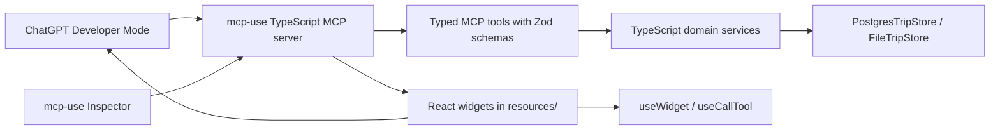

# refactor: Rewrite Travel MCP app in TypeScript

## Overview

Rewrite the Travel MCP app as a TypeScript/Node project using `mcp-use` TypeScript as the primary MCP Apps framework. The goal is to remove the current mixed Python + TypeScript split and evaluate whether a single TypeScript stack is more comfortable and maintainable for future ChatGPT Apps work.

This replaces the previous Python-first framework bake-off. The new target is a complete TypeScript implementation:

- MCP server: TypeScript with `mcp-use/server`.
- Widgets: TypeScript/React widgets under `resources/`.
- Domain logic: TypeScript ports of trip, packing, weather, and travel-tip logic.
- Persistence: TypeScript Postgres/File trip store parity with current Python behavior.
- Tests: TypeScript-first parity tests, with current Python behavior consulted from git history/main only while porting.
- Deployment: Node/TypeScript deployment path, likely Manufact Cloud or another Node-friendly host.

The rewrite must still preserve the origin product decisions (see origin: `docs/brainstorms/2026-05-05-apps-sdk-revalidation-requirements.md`): keep the MVP centered on persisted trip workspace state, keep generic weather/forecast widgets out of the current ChatGPT app surface unless redesigned around saved trip context, gate widgets through Apps SDK UX value, and require hosted ChatGPT Developer Mode validation before submission-ready claims.

## Current Implementation Status

Local TypeScript migration work is complete on branch `codex/evaluate-mcp-use-migration` as of 2026-05-06:

- Root Python/FastAPI/FastMCP runtime, Python tests, and legacy Storybook/static widget stack have been removed from this branch.
- The root Node/TypeScript app now owns the MCP server, trip domain logic, file/Postgres stores, retained React widgets, and validation scripts.
- The app exposes the 9 retained MVP trip workspace tools through `mcp-use/server`.
- `mcp-use` Inspector is the primary local validation path.
- `npm run check` passes locally, including typecheck, Vitest, and widget build.
- MCP protocol regression coverage now validates OpenAI-compatible tool schemas, widget templates, rich metadata persistence, board/itinerary/budget rendering, and a `DATABASE_URL`-gated Postgres parity path.

Still pending before submission-ready claims:

- Hosted HTTPS deployment.
- Hosted ChatGPT Developer Mode validation against the deployed endpoint.
- Production metadata/CSP/domain review for the hosted environment.

## Problem Statement

The current repo is split:

- Python owns FastAPI, MCP servers, MCP clients, trip persistence, weather, packing, and travel tips.
- TypeScript owns Storybook fixtures and preview harnesses for static HTML widgets.
- Widgets themselves are static HTML/CSS/JS resources rather than typed React components.

This makes ChatGPT Apps iteration awkward. UI and bridge behavior live in TypeScript-ish tooling, while tool descriptors, result shapes, persistence, and server behavior live in Python. Every meaningful widget change crosses languages, test frameworks, and runtime assumptions.

The TypeScript rewrite should answer one explicit question: is the project easier to work on when the MCP server, widget framework, tool schemas, UI components, bridge hooks, and tests all live in one TypeScript stack?

## Target Architecture



Proposed top-level shape:

```text
travel-mcp-app/
  package.json
  tsconfig.json
  src/
    server.ts
    config.ts
    domain/
      trips.ts
      packing.ts
      travelTips.ts
      weather.ts
    stores/
      tripStore.ts
      fileTripStore.ts
      postgresTripStore.ts
    tools/
      travelAgent.ts
      packing.ts
      travelTips.ts
      weather.ts
    resources/
      trip-board/widget.tsx
      trip-inbox/widget.tsx
      trip-itinerary/widget.tsx
      trip-budget/widget.tsx
    fixtures/
      travelFixtures.ts
    tests/
      tripStore.test.ts
      travelAgentTools.test.ts
      widgets.test.ts
```

The exact layout can change during implementation, but the final state should have one TypeScript runtime for the ChatGPT-facing app.

## Scope

### In Scope

- Replace Python FastAPI/FastMCP MCP server with TypeScript `mcp-use`.
- Port the unified travel-agent MVP tool surface:
  - `create_trip`
  - `add_trip_item`
  - `list_trip_inbox`
  - `update_trip_item_status`
  - `get_trip_board`
  - `render_trip_board`
  - `get_trip_itinerary`
  - `get_trip_budget`
  - `get_trip_summary`
- Port trip persistence:
  - file-backed store for local smoke testing
  - Postgres-backed store for hosted use
  - duplicate detection and normalized raw content behavior
  - board, itinerary, budget, and summary builders
- Rebuild retained MVP widgets as React widgets through `mcp-use`.
- Add TypeScript tests for parity with current Python behavior.
- Replace Storybook as the primary widget validation path with the `mcp-use` Inspector, unless Storybook still provides unique visual regression value.
- Update docs for the new TypeScript workflow.

### Out Of Scope Unless Revalidated

- Weather/forecast widgets in the ChatGPT MVP.
- Static destination guide widgets.
- Generic activity/packing widgets that do not use saved trip context.
- Maintaining Python and TypeScript production runtimes side by side.
- Keeping a `legacy-python/` folder in this branch.
- Keeping `pyproject.toml`, Python app modules, Python MCP servers, or Python tests after the TypeScript rewrite lands.

Python can be consulted from git history or `main` while porting. It should not remain in this branch's final tree.

## Implementation Phases

### Phase 0: Baseline Current Behavior From Main

Before deleting Python from this branch, record the current behavior as a migration artifact:

- Run `python -m pytest`.
- Run `cd mcp_servers/widgets && npm run check`.
- Save the expected tool list from `/mcp/travel-agent/`.
- Save sample outputs for:
  - create trip
  - add duplicate and non-duplicate trip item
  - board grouping
  - itinerary grouping
  - budget parsing
  - summary missing pieces
  - missing database configuration error
- Treat current tests under `tests/` as the migration oracle, then replace them with TypeScript tests.

Success criteria:

- There is a concrete parity checklist before deleting Python files from the branch.
- Known current quirks are documented so the TypeScript rewrite does not accidentally preserve bugs as requirements.

### Phase 1: Scaffold TypeScript mcp-use App

- Initialize a TypeScript Node project at the repo root.
- Use `mcp-use` TypeScript and `@mcp-use/cli`.
- Pin known evaluated versions unless newer versions are intentionally selected:
  - `mcp-use@1.26.0`
  - `@mcp-use/cli@3.1.2`
  - `@mcp-use/inspector@4.0.0`
- Use Node compatible with `^20.19.0 || >=22.12.0`.
- Add scripts:
  - `dev`
  - `build`
  - `typecheck`
  - `test`
  - `check`
- Add lint/format only if it does not slow the first parity pass.

Success criteria:

- `npm run dev` starts the MCP app and opens/serves the Inspector.
- A trivial tool and widget can execute locally.
- `npm run check` exists from the beginning.

### Phase 2: Port Domain Models And Pure Functions

Port pure Python behavior first, before MCP tools:

- Trip model.
- Trip item model.
- Item status enum.
- Item type classification.
- Raw content normalization and duplicate key generation.
- `build_board`.
- `build_itinerary`.
- `build_budget`.
- `summarize_items`.
- Packing list generation if retained.
- Travel tips sample data if retained outside MVP.

Add TypeScript tests that mirror the current Python tests:

- `tests/test_trip_store.py`
- `tests/test_packing_server.py`
- `tests/test_travel_tips.py`

Success criteria:

- TypeScript pure-function tests pass.
- Outputs match Python fixtures for representative cases.
- Domain code has no MCP/framework dependency.

### Phase 3: Port Trip Stores

Implement TypeScript persistence:

- `TripStore` interface.
- `InMemoryTripStore` for tests.
- `FileTripStore` for local smoke tests.
- `PostgresTripStore` for hosted use.

Preserve behavior:

- duplicate detection
- stable IDs
- validation errors
- missing trip errors
- status updates
- file locking or atomic write equivalent where needed
- Postgres schema initialization if current Python store owns it

Choose Postgres driver:

- likely `pg`, unless `postgres` or another client better matches deployment
- use parameterized queries
- keep schema creation and migrations explicit

Success criteria:

- TypeScript trip store tests cover the same scenarios as Python.
- Postgres integration test is skippable unless `DATABASE_URL` is set.
- File store works without external services.

### Phase 4: Port MCP Tool Surface

Implement the 9 MVP tools with `mcp-use/server`.

Use Zod schemas with descriptions for all tool inputs. Preserve descriptor quality:

- clear tool titles
- intent-based descriptions
- read-only/mutation annotations
- idempotency annotation for duplicate-safe `add_trip_item`
- invocation status strings
- data/render split

Preserve current interaction model:

- `get_trip_board` remains data-only.
- `render_trip_board` owns the visual board widget.
- `add_trip_item` saves data without forcing a widget render.
- Errors are returned as MCP tool errors with model-readable text and structured error content.

Success criteria:

- Inspector lists exactly the intended MVP tools.
- Tool calls return equivalent data to the Python implementation.
- Tool descriptor tests prove data-only tools do not advertise widget templates.

### Phase 5: Rebuild Widgets In React

Migrate retained widgets:

- `trip-board`
- `trip-inbox`
- `trip-itinerary`
- `trip-budget`

Use `mcp-use/react`:

- `useWidget()` for props/output/theme/loading state.
- `useCallTool()` only when widget-initiated tool calls are part of the flow.
- typed props derived from shared domain/tool output types where practical.
- no static long-form surfaces that ChatGPT can answer directly.

Design constraints:

- Works at 320px to 800px.
- ChatGPT-native, compact, no app-shell chrome.
- No nested scrolling unless the host explicitly needs it.
- Clear empty, loading, error, and long-content states.
- Light/dark theme support.

Success criteria:

- Inspector can render each widget from real tool calls.
- Widgets pass responsive checks.
- Replacing the widget with text would materially reduce clarity or triage speed.

### Phase 6: Replace Legacy Validation Stack

Decide what happens to Storybook:

- If `mcp-use` Inspector fully covers widget/tool preview, retire Storybook.
- If Storybook still helps visual regression, keep it but point stories at React widgets or built artifacts, not legacy static HTML.

Add validation commands:

- TypeScript unit tests.
- MCP tool integration tests.
- Inspector/manual smoke checklist.
- Hosted Developer Mode checklist.

Success criteria:

- There is one obvious local development command.
- There is one obvious CI command.
- Docs no longer describe Python MCP servers as the primary path.

### Phase 7: Port Or Delete Supporting Features

Inventory non-MVP Python modules:

- weather server
- travel tips server
- packing server
- API route `/api/v1/travel/plan`
- MCP client wrappers

For each, choose:

- port to TypeScript
- fold into the travel-agent app
- retire

Expected decisions:

- Weather/forecast: port domain logic only if needed outside MVP; do not ship widgets in MVP.
- Travel tips/activity: port only if reframed around saved trip context.
- Packing: port if it becomes saved-trip-aware or remains useful as a plain tool.
- MCP clients: likely retire because the TypeScript app owns the MCP surface.
- FastAPI API route: retire or replace with a Node HTTP route only if still needed.

Success criteria:

- No Python module remains in the branch's app/test/runtime tree.
- Any retained non-MVP feature has an explicit product reason.

### Phase 8: Deployment Cutover

Choose Node-friendly hosting:

- Manufact Cloud if it gives the best `mcp-use` deployment and observability path.
- Vercel/Render/Fly/Railway if they better fit Node and Postgres.
- Keep FastAPI Cloud only if it can host the Node app cleanly, which is unlikely.

Define:

- public MCP URL
- environment variables
- `DATABASE_URL`
- file-store smoke mode, if any
- `_meta.ui.domain`
- CSP domains
- DNS rebinding behavior
- logs
- rollback plan

Success criteria:

- Hosted endpoint is reachable over HTTPS.
- ChatGPT Developer Mode can connect.
- Production metadata is correct.
- Database-backed trip state persists across restarts.

### Phase 9: Delete Python Path

After TypeScript parity and hosted validation:

- Delete Python app files from the branch.
- Delete `pyproject.toml`.
- Delete Python tests after equivalent TypeScript tests exist.
- Delete Python MCP server modules.
- Delete Python service modules.
- Delete Python client modules.
- Remove FastAPI Cloud docs from primary README.
- Keep a migration note explaining where old behavior was ported, but do not keep a Python source copy.

Success criteria:

- The repo has one production runtime.
- New developers can run the app with Node/TypeScript only.
- Python is not required to build, test, or run anything in this branch.

## System-Wide Impact

### Interaction Graph

User asks ChatGPT to manage a trip. ChatGPT calls the TypeScript `mcp-use` server. The server executes typed tools, calls TypeScript domain services, persists through a TypeScript store, and returns model-visible output plus widget props. ChatGPT or the `mcp-use` Inspector renders React widgets. UI actions call tools through `useCallTool()` only when needed.

### Error Propagation

Port Python error classes into TypeScript equivalents:

- `TripStoreError`
- `TripConfigError`
- `TripConnectionError`
- `TripValidationError`
- `TripNotFoundError`

Every tool should map domain errors to MCP errors with:

- `isError` or equivalent framework error response
- structured error content
- concise model-readable text
- no misleading success widget

### State Lifecycle Risks

Risks:

- duplicate detection changes during port
- money/date parsing changes
- file persistence loses atomic behavior
- Postgres schema drifts
- widget state becomes canonical instead of persisted trip state

Mitigations:

- parity fixtures from Python
- store-level tests before MCP tools
- canonical state returned after every mutation
- UI state limited to presentation preferences
- database integration tests gated by `DATABASE_URL`

### API Surface Parity

Must port or intentionally retire:

- `services/trips.py`
- `services/packing.py`
- `services/travel_tips.py`
- `services/openweather.py`
- `mcp_servers/travel_agent_server.py`
- `mcp_servers/packing_server.py`
- `mcp_servers/travel_tips_server.py`
- `mcp_servers/weather_server.py`
- `mcp_clients/*`
- `app/*`
- `tests/*`
- `mcp_servers/widgets/*`

## Acceptance Criteria

### Functional Requirements

- [ ] TypeScript `mcp-use` app exposes the 9 MVP travel-agent tools.
- [ ] TypeScript trip domain tests match current Python behavior.
- [ ] File and Postgres trip stores work in TypeScript.
- [ ] React widgets replace retained static HTML widgets.
- [ ] Inspector validates widget rendering before ChatGPT Developer Mode.
- [ ] Hosted Developer Mode completes the MVP trip flow.
- [ ] Python source, tests, and project config are removed from the final branch state.
- [ ] Python is not required to build, test, or run anything in this branch.

### Non-Functional Requirements

- [ ] Widgets work from 320px to 800px.
- [ ] Tool descriptors remain model-friendly.
- [ ] CSP and production domain metadata are explicit.
- [ ] TypeScript build and tests are fast enough for normal iteration.
- [ ] Deployment path is documented and repeatable.

### Quality Gates

- [ ] `npm run typecheck` passes.
- [ ] `npm test` passes.
- [ ] `npm run build` passes.
- [ ] `npm run check` passes.
- [ ] Parity checklist against Python implementation is complete.
- [ ] Hosted ChatGPT Developer Mode validation passes.

## Success Metrics

- A developer can run, test, and preview the app with Node/TypeScript only.
- Tool schemas, server implementation, and widgets share TypeScript types.
- The `mcp-use` Inspector becomes the primary local ChatGPT Apps validation loop.
- The codebase has less custom bridge/resource glue than the current Python/static HTML path.
- The user can decide whether TypeScript feels more comfortable than Python based on a real, working rewrite.

## Dependencies And Risks

- `mcp-use` TypeScript package evaluated at `1.26.0`.
- `@mcp-use/cli` evaluated at `3.1.2`.
- `@mcp-use/inspector` evaluated at `4.0.0`.
- Node requirement is `^20.19.0 || >=22.12.0`.
- Full rewrite risk is high: behavior parity, persistence bugs, deployment differences, and widget regressions.
- Current Python code is working; the rewrite must be justified by maintainability and developer comfort.
- Hosted deployment target changes from FastAPI Cloud unless a Node-compatible path is confirmed.

## Documentation Plan

- Rewrite README around TypeScript quick start.
- Replace Python MCP endpoint docs in `docs/testing_chatgpt_apps.md`.
- Update `docs/chatgpt_apps_readiness_review.md`.
- Add `docs/migration/python-to-typescript.md` with parity decisions.
- Preserve source links to the origin requirements document.

## Sources And References

### Origin

- **Origin document:** `docs/brainstorms/2026-05-05-apps-sdk-revalidation-requirements.md`
  - Carried forward: preserve trip workspace MVP focus, keep generic weather/forecast out of current ChatGPT app surface, gate widgets through Apps SDK UX value, and require hosted ChatGPT Developer Mode validation.

### Internal References

- `README.md` - current FastAPI/FastMCP quick start and project structure.
- `docs/testing_chatgpt_apps.md` - current protocol and widget bridge testing guide.
- `docs/chatgpt_apps_readiness_review.md` - readiness gaps and hosted validation requirement.
- `docs/solutions/integration-issues/apps-sdk-trip-workspace-mvp-tool-render-alignment-20260505.md` - prior tool/render alignment lessons.
- `docs/solutions/ui-bugs/storybook-widget-preview-v3-ui-drift-20260505.md` - widget preview and resource-versioning gotchas.
- `docs/solutions/test-failures/storybook-widget-typescript-pr-checks.md` - TypeScript validation lessons.
- `services/trips.py` - main domain/persistence source to port.
- `mcp_servers/travel_agent_server.py` - current MVP MCP tool contract.
- `tests/test_trip_store.py` and `tests/test_travel_agent_server.py` - parity oracle.

### External References

- `mcp-use` ChatGPT Apps flow: https://manufact.com/docs/guides/chatgpt-apps-flow
- `mcp-use` TypeScript server with widgets guide: https://manufact.com/docs/typescript/server/creating-mcp-apps-server
- `mcp-use` Inspector CLI: https://manufact.com/docs/inspector/cli
- `mcp-use` npm package: https://www.npmjs.com/package/mcp-use
- `@mcp-use/cli` npm package: https://www.npmjs.com/package/@mcp-use/cli
