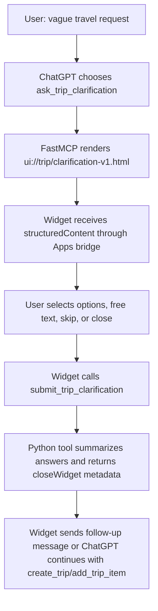

# feat: Backport MCP UI improvements to Python app

## Overview

Create a new PR from `main` that keeps the FastAPI/FastMCP Python runtime and backports the useful MCP and Storybook improvements from the TypeScript migration branch. The TypeScript code now lives separately in `/Users/vladislavcaraseli/Documents/travel-apps-mcp`; this plan treats PR #20 as a reference implementation, not something to merge into the Python app.

The target PR should add the clarification flow for simple underspecified requests such as "I want to plan a trip to Venice", "I want to book hotel in Paris", and "I want to book fly to Tokyo", while preserving the existing Python deployment path. This carries forward the origin decision to stay Python-first for now and avoid migrating runtimes just because TypeScript examples exist (see origin: `docs/brainstorms/2026-05-05-apps-sdk-revalidation-requirements.md`).

## Problem Statement

PR #20 contains valuable product and Apps SDK work, but it also deletes the Python application, Python tests, FastAPI Cloud deploy config, and static widget package. Merging it would break the current deployment model.

The useful work should be separated from the runtime migration:

- Keep `app/`, `services/`, `mcp_servers/`, `pyproject.toml`, `uv.lock`, `.fastapicloudignore`, and the FastAPI deploy workflow.
- Add clarification tools and widget behavior from the TypeScript branch.
- Keep or improve the Python-era Storybook review surface under `mcp_servers/widgets`.
- Avoid root-level Node/mcp-use scaffolding from PR #20.

This aligns with the origin scope boundary: do not replace the Python MCP server solely because examples often use TypeScript (see origin: `docs/brainstorms/2026-05-05-apps-sdk-revalidation-requirements.md`).

## Proposed Solution

Create a new branch from `main`, for example:

```bash
git switch main
git pull --ff-only
git switch -c codex/python-mcp-ui-clarification-backport
```

Implement a focused Python PR with three deliverables:

1. **Python clarification tool surface**
   Add Python equivalents of `prepare_trip_clarification`, `ask_trip_clarification`, `render_trip_clarification`, and `submit_trip_clarification`.

2. **Static clarification widget and Storybook stories**
   Add a self-contained HTML widget under `mcp_servers/widgets/`, plus Storybook stories and chat-preview scenarios using the existing Python-era iframe host harness.

3. **Regression tests and docs**
   Extend Python tests to cover tool descriptors, structured outputs, widget metadata, close lifecycle metadata, and ChatGPT Developer Mode prompts.

Do not cherry-pick the TypeScript migration commits directly. Instead, port behavior intentionally into the Python architecture.

## Source Branch Reference

Use the current TypeScript branch as a behavioral oracle only:

- `src/domain/clarification.ts`: question selection, intent inference, known-field omission, answer summary.
- `src/tools/travelAgent.ts`: tool names, descriptions, `ask_trip_clarification` routing, `create_trip` descriptor guard, `openai/closeWidget` metadata.
- `resources/trip-clarification/widget.tsx`: UI behavior, skip/free-text/previous-next states, submit error state, `window.openai.requestClose()` lifecycle.
- `resources/trip-clarification/widget.stories.tsx`: story states to reproduce in static Storybook.
- `tests/travelAgentTools.test.ts` and `tests/mcpIntegration.test.ts`: expected behavior and metadata coverage.
- `docs/solutions/integration-issues/chatgpt-apps-trip-clarification-widget-lifecycle-20260508.md`: verified ChatGPT lifecycle learning.

## Technical Approach

### Branch and PR Boundary

The new PR should be based on `main`, not the TypeScript migration branch. The PR must not include:

- Root `package.json`, `package-lock.json`, `tsconfig.json`, `vite.config.ts`, or `index.ts`.
- Root `.storybook/`.
- `src/` or `resources/` TypeScript app directories.
- Deletions of `app/`, `services/`, `mcp_servers/`, `tests/`, `pyproject.toml`, or `uv.lock`.
- Removal of FastAPI Cloud deploy files.

### Python Domain Logic

Add a Python domain/helper module, likely `services/trip_clarification.py`, with dataclass or dict-producing functions equivalent to the TypeScript clarification domain:

- infer intent from utterance: `plan_trip`, `book_hotel`, `book_flight`
- infer destination from simple "to/in/for X" phrasing
- merge known model fields with optional persisted trip state
- omit already-known questions
- return at most five questions
- summarize answers into:
  - `resolved_fields`
  - `remaining_fields`
  - `recommended_next_action`
  - model-readable summary

Keep this logic outside `mcp_servers/travel_agent_server.py` so tests can cover it without MCP transport.

### MCP Tools

Update `mcp_servers/travel_agent_server.py`:

- Add `prepare_trip_clarification` as data-only/read-only.
- Add `ask_trip_clarification` as the widget-first tool for vague first-turn requests.
- Add `render_trip_clarification` as the explicit render tool.
- Add `submit_trip_clarification` as the answer submission tool.
- Update `create_trip` description so it is not the obvious first action for vague prompts.
- Register a new `ui://trip/clarification-v1.html` resource.
- Return `_meta["openai/closeWidget"] = True` from `submit_trip_clarification`.

The tool split follows the origin requirement that non-trivial flows should move toward data/mutation tools returning reusable `structuredContent`, while render tools own `_meta.ui.resourceUri` and `_meta["openai/outputTemplate"]` (see origin: `docs/brainstorms/2026-05-05-apps-sdk-revalidation-requirements.md`).

### Widget Implementation

Add `mcp_servers/widgets/trip_clarification_v1.html` as a self-contained static widget. It should match the current Python widget architecture rather than importing React:

- read data from `window.openai.toolOutput`
- listen for `openai:set_globals`
- listen for `ui/notifications/tool-result`
- render compact question UI with options, free text, skip, previous/next, close, and submit states
- feature-detect `window.openai.requestClose`
- call `window.openai.callTool("submit_trip_clarification", ...)` if available
- call `window.openai.sendFollowUpMessage(...)` if available
- preserve selected answers if submit fails
- show an error/retry state when bridge calls fail

The visual style should reuse existing v3 widget conventions from the Python branch: compact ChatGPT-native surface, restrained color, no app-shell chrome, mobile-safe layout, and no nested scrolling. This carries forward the origin UX gate that widgets must be helpful UI, not static content ChatGPT could answer in text (see origin: `docs/brainstorms/2026-05-05-apps-sdk-revalidation-requirements.md`).

### Storybook

Keep Storybook under `mcp_servers/widgets`. Add:

- `mcp_servers/widgets/stories/TripClarification.stories.ts`
- clarification fixtures in `mcp_servers/widgets/stories/fixtures/travelFixtures.ts`
- a clarification step in `mcp_servers/widgets/stories/chat/scenarios.ts`
- update `mcp_servers/widgets/.storybook/main.ts` whitelist to serve `trip_clarification_v1.html`
- update `mcp_servers/widgets/stories/renderWidget.ts` only as needed to simulate:
  - `window.openai.callTool`
  - `window.openai.sendFollowUpMessage`
  - `window.openai.requestClose`
  - close lifecycle state

Keep the existing Storybook lesson: inspect nested iframes during QA, because parent-frame text is not enough evidence that a widget rendered correctly.

### Tests

Extend Python tests:

- `tests/test_travel_agent_server.py`
  - prepares intent-specific clarification questions
  - omits questions from known model fields and existing trip state
  - renders clarification with correct structured content and template metadata
  - submit returns `recommended_next_action`, `resolved_fields`, `remaining_fields`, and `_meta["openai/closeWidget"]`
  - `create_trip` descriptor discourages vague first-turn use

- `tests/test_apps_ui_resources.py`
  - new resource starts with `<!doctype html>`
  - includes bridge listeners
  - includes `requestClose`
  - includes `submit_trip_clarification`

- Storybook package checks
  - `cd mcp_servers/widgets && npm run check`

- Full Python checks
  - `python -m pytest`

## System-Wide Impact

### Interaction Graph



### Error & Failure Propagation

- Invalid trip ids should reuse existing `_run_trip_tool()` error handling.
- Invalid JSON-like answer payloads should return model-visible MCP errors, not silently render empty state.
- Bridge failures in the widget should show retry UI and keep selected answers.
- Close failures should not lose submitted answers; `_meta["openai/closeWidget"] = True` provides server-side backup.

### State Lifecycle Risks

The MVP submission tool should not directly persist new trip state unless implementation explicitly chooses that behavior later. It should return structured context and let ChatGPT call existing persistence tools. This avoids partial writes when the user answers a transient question form but the next action is still ambiguous.

### API Surface Parity

The Python branch should expose the same names and behavior as the TypeScript app for the clarification flow:

- `prepare_trip_clarification`
- `ask_trip_clarification`
- `render_trip_clarification`
- `submit_trip_clarification`

Existing Python tools remain:

- `create_trip`
- `add_trip_item`
- `list_trip_inbox`
- `update_trip_item_status`
- `get_trip_board`
- `render_trip_board`
- `get_trip_itinerary`
- `get_trip_budget`
- `get_trip_summary`

### Integration Test Scenarios

1. Vague trip flow: "I want to plan a trip to Venice" opens clarification instead of creating a trip immediately.
2. Hotel flow: "I want to book hotel in Paris" asks hotel dates, area, and budget.
3. Flight flow: "I want to book fly to Tokyo" asks origin, date flexibility, and priority.
4. Existing trip flow: known dates and saved hotel state omit redundant questions.
5. Submit lifecycle: final answer returns close metadata and a summary ChatGPT can use for the next tool call.

## Acceptance Criteria

### Functional Requirements

- [ ] New PR is based on `main` and keeps the Python/FastAPI deployment intact.
- [ ] No TypeScript runtime migration files are included in the Python PR.
- [ ] `ask_trip_clarification` is advertised as the first action for simple vague planning, hotel, and flight requests.
- [ ] `create_trip` descriptor says not to use it first for vague requests before clarification.
- [ ] `prepare_trip_clarification` returns reusable structured question data without widget metadata.
- [ ] `ask_trip_clarification` and `render_trip_clarification` advertise `ui://trip/clarification-v1.html` through both `_meta.ui.resourceUri` and `_meta["openai/outputTemplate"]`.
- [ ] `submit_trip_clarification` returns resolved fields, remaining fields, recommended next action, summary text, and `_meta["openai/closeWidget"] = True`.
- [ ] Clarification widget supports option selection, free-text answer, skip, previous/next, close, submitting, submitted, and error/retry states.
- [ ] Storybook includes standalone clarification stories plus at least one chat-preview scenario.

### Non-Functional Requirements

- [ ] Widget remains static/self-contained under `mcp_servers/widgets`, consistent with the Python branch.
- [ ] Widget is usable between 320px and 800px iframe widths.
- [ ] Bridge calls are feature-detected and do not crash outside ChatGPT.
- [ ] Tool outputs remain model-readable through `structuredContent` and `content`.
- [ ] Hosted ChatGPT Developer Mode validation is completed before marking submission-ready, per origin R13.

### Quality Gates

- [ ] `python -m pytest` passes.
- [ ] `cd mcp_servers/widgets && npm run check` passes.
- [ ] Storybook renders clarification stories and the chat-preview flow.
- [ ] MCP tool descriptor tests cover clarification metadata and absence of accidental widget templates on data-only tools.
- [ ] Manual ChatGPT Developer Mode prompt confirms vague requests open the clarification UI.

## Dependencies & Risks

- **FastMCP metadata support:** Existing Python `@server.tool(..., meta=...)` already supports widget metadata for current widgets, so the clarification tools should follow that pattern.
- **Widget bridge API availability:** `callTool`, `sendFollowUpMessage`, and `requestClose` must be feature-detected because Storybook and non-ChatGPT hosts may not provide them.
- **Payload validation:** `submit_trip_clarification` receives client-controlled payloads. The first PR should validate expected session and answers shapes enough to avoid malformed summaries.
- **Storybook drift:** Do not create a separate showcase that diverges from the production HTML resource. Storybook must render the same `trip_clarification_v1.html` file.
- **Scope creep:** Do not reintroduce generic weather, forecast, or destination-guide expansion in this PR. The origin explicitly says weather/forecast and static destination content are out of MVP unless redesigned around saved trip state.

## Alternative Approaches Considered

- **Merge PR #20 and fix deployment later:** Rejected because it deletes the current Python deployment surface.
- **Cherry-pick TypeScript commits:** Rejected because the commits mix product behavior with runtime migration. Port behavior instead.
- **Use React/mcp-use widgets inside the Python repo:** Rejected for this PR. The origin says do not migrate to React or a new build/output contract until a specific widget needs that complexity.
- **Keep only Storybook UI and skip MCP tools:** Rejected because ChatGPT routing depends on tool descriptors, structured content, and output template metadata.

## Implementation Checklist

- [ ] Create branch from `main`: `codex/python-mcp-ui-clarification-backport`.
- [ ] Add `services/trip_clarification.py`.
- [ ] Add unit tests for clarification domain behavior.
- [ ] Update `mcp_servers/travel_agent_server.py` with clarification tools and resource registration.
- [ ] Add `mcp_servers/widgets/trip_clarification_v1.html`.
- [ ] Add `mcp_servers/widgets/stories/TripClarification.stories.ts`.
- [ ] Extend `mcp_servers/widgets/stories/fixtures/travelFixtures.ts`.
- [ ] Extend `mcp_servers/widgets/stories/chat/scenarios.ts`.
- [ ] Extend `mcp_servers/widgets/stories/renderWidget.ts` only for bridge/close simulation needed by the new story.
- [ ] Extend `tests/test_travel_agent_server.py`.
- [ ] Extend `tests/test_apps_ui_resources.py`.
- [ ] Update `docs/testing_chatgpt_apps.md` with the clarification Developer Mode prompts.
- [ ] Run `python -m pytest`.
- [ ] Run `cd mcp_servers/widgets && npm run check`.
- [ ] Open Storybook and verify nested iframe rendering for the clarification stories.

## SpecFlow Analysis

### User Flow Overview

- First-turn planning: user asks for a trip with too little context; ChatGPT opens the clarification widget; user answers or skips; ChatGPT creates a trip or asks a text follow-up.
- Existing trip enrichment: user asks for hotel or flight help on a saved trip; app omits known dates/destination; widget asks only missing high-value questions.
- Error recovery: widget submit fails because bridge/tool call is unavailable; selected answers stay visible and the user can retry.
- Dismissal: user closes the widget; the app should not create or mutate trip state.

### Missing Elements & Gaps

- Exact persistence behavior after submit must stay conservative. Default: return structured summary and let ChatGPT call existing tools.
- Storybook host simulation currently covers `openai:set_globals` and tool-result notifications; it may need small extensions for call/close behavior.
- Hosted Developer Mode validation is still required because Storybook cannot prove ChatGPT iframe lifecycle behavior.

### Recommended Defaults

- Use the same question sets and action names as the TypeScript branch for parity.
- Make `ask_trip_clarification` the model-obvious first action.
- Use both widget-side `requestClose()` and server-side `_meta["openai/closeWidget"] = True` when possible.

## Sources & References

### Origin

- **Origin document:** `docs/brainstorms/2026-05-05-apps-sdk-revalidation-requirements.md`
  - Carried-forward decisions: stay Python-first, keep unified `/mcp/travel-agent/`, focus on persisted trip workspace, decouple data/mutation tools from render tools, require hosted Developer Mode validation.

### Internal References

- `mcp_servers/travel_agent_server.py` on `main`: current FastMCP tools, `_render_meta`, widget resources, and `render_trip_board` split.
- `mcp_servers/widgets/.storybook/main.ts` on `main`: static HTML whitelist plugin for Storybook.
- `mcp_servers/widgets/stories/renderWidget.ts` on `main`: Apps SDK-style Storybook host harness.
- `tests/test_travel_agent_server.py` on `main`: existing Python tool behavior tests.
- `src/domain/clarification.ts` on PR #20 branch: reference logic for question selection and summaries.
- `resources/trip-clarification/widget.tsx` on PR #20 branch: reference UI behavior and close lifecycle.
- `tests/travelAgentTools.test.ts` on PR #20 branch: reference assertions for clarification behavior.

### Institutional Learnings

- `docs/solutions/integration-issues/apps-sdk-trip-workspace-mvp-tool-render-alignment-20260505.md`: data/mutation tools should not automatically advertise widgets; render tools own UI templates.
- `docs/solutions/integration-issues/schema-compatible-mcp-chatgpt-apps-inspector-20260506.md`: validate real MCP descriptors and schema compatibility, not only handler behavior.
- `docs/solutions/integration-issues/chatgpt-apps-trip-clarification-widget-lifecycle-20260508.md`: transient widgets need explicit close behavior and model-obvious widget-first tools.
- `docs/solutions/ui-bugs/storybook-widget-preview-v3-ui-drift-20260505.md`: Storybook must render production widget files through a host harness and nested iframe QA.
- `docs/solutions/ui-bugs/chatgpt-native-widget-overflow-travel-mcp-widgets-20260504.md`: keep widgets compact, ChatGPT-native, mobile-safe, and free of app-shell chrome.
